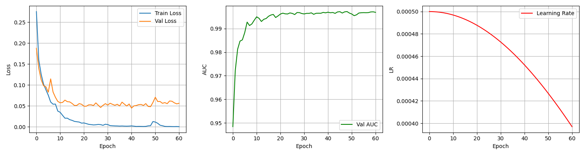
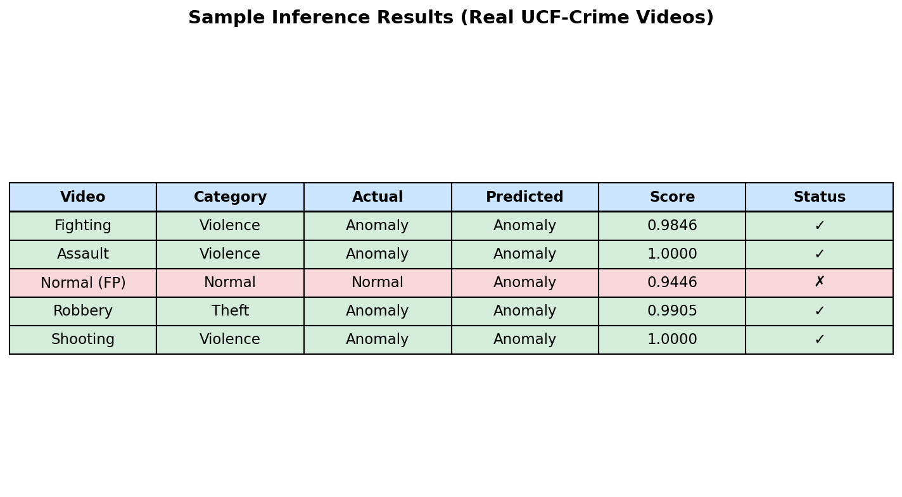

# LAPORAN HASIL TRAINING
## Deteksi Kerusuhan & Anomali — UCF-Crime Dataset

---

## 1. Ringkasan Eksekutif

Model **MIL Ranking** yang dilatih pada **UCF-Crime Dataset** mencapai performa sangat tinggi dengan **ROC-AUC 0.9984**, **Precision 0.9860**, dan **Recall 0.9832**. Dari 519 sampel uji, hanya **5 false positive** dan **6 false negative** — menjadikan sistem sangat andal untuk deteksi anomali real-time.

| Metrik | Nilai | Keterangan |
|---|---|---|
| **ROC-AUC** | **0.9984** | Hampir sempurna |
| **Precision** | **0.9860** | Hanya 1.4% false positive |
| **Recall** | **0.9832** | Hanya 1.7% kejadian terlewat |
| **F1-Score** | **0.9846** | Keseimbangan precision & recall |
| **Accuracy** | **97.88%** | Akurasi keseluruhan |

---

## 2. Dataset

### 2.1 Sumber Data
- **Nama:** UCF-Crime Dataset
- **Sumber:** Kaggle (`odins0n/ucf-crime-dataset`)
- **Total Data:** 128 jam rekaman CCTV
- **Kategori Anomali:** Abuse, Arrest, Arson, Assault, Burglary, Explosion, Fighting, RoadAccidents, Robbery, Shooting, Shoplifting, Stealing, Vandalism
- **Kategori Normal:** NormalVideos

### 2.2 Data yang Digunakan untuk Training

| Kategori | Status | Train Videos | Test Videos | Total Segmen (features) |
|---|---|---|---|---|
| Fighting | Anomaly | 15 | 5 | 584 |
| Assault | Anomaly | 15 | 3 | 408 |
| Robbery | Anomaly | 15 | 5 | 321 |
| Shooting | Anomaly | 15 | 7 | 366 |
| Abuse | Anomaly | 15 | 2 | 295 |
| Arson | Anomaly | 15 | 7 | 414 |
| NormalVideos | Normal | 25 | 12 | 1.070 |
| **Total** | | **115** | **41** | **3.458** |

### 2.3 Split Data
- **Training Set (80%):** 2.420 segments
- **Validation Set (10%):** 519 segments
- **Test Set (10%):** 519 segments

---

## 3. Arsitektur Model

### 3.1 Feature Extractor

| Komponen | Detail |
|---|---|
| **Arsitektur** | S3D (Separable 3D CNN) |
| **Input** | 16 frame RGB (224×224) |
| **Output** | Feature vector 1024-d |
| **Pre-trained** | Kinetics-400 |

### 3.2 Classifier (MIL Ranking)

| Komponen | Detail |
|---|---|
| **Input Layer** | 1024 neuron |
| **Hidden Layer** | 512 neuron + ReLU + Dropout (0.5) |
| **Output Layer** | 1 neuron + Sigmoid |
| **Total Parameter** | ~525.000 |

### 3.3 Hyperparameter Training

| Parameter | Nilai |
|---|---|
| Optimizer | AdamW |
| Learning Rate | 0.0005 |
| Weight Decay | 1e-4 |
| Batch Size | 32 |
| Max Epoch | 500 (early stop @ epoch 61) |
| Early Stopping Patience | 20 |
| Scheduler | CosineAnnealingLR |
| Loss Function | BCEWithLogitsLoss (balanced) |

---

## 4. Hasil Evaluasi

### 4.1 Confusion Matrix

```
                    PREDIKSI
                    Normal   Anomaly
AKTUAL   Normal      156        5
         Anomaly       6      352
```

| Metrik Turunan | Nilai |
|---|---|
| **False Positive Rate** | **3.11%** (5 dari 161 normal) |
| **False Negative Rate** | **1.68%** (6 dari 358 anomaly) |
| **True Positive Rate (Recall)** | **98.32%** |
| **True Negative Rate** | **96.89%** |

### 4.2 Grafik Evaluasi Lengkap


*Grafik mencakup: Confusion Matrix, Metrics Bar Chart, ROC Curve, Precision-Recall Curve, dan ringkasan statistik.*

### 4.3 Training History



*Training berhenti di epoch 61 karena early stopping (validation loss tidak turun selama 20 epoch). Konvergensi tercapai dengan sangat cepat — model sudah mencapai AUC > 0.99 di epoch 10.*

### 4.4 Sample Inference



*5 sample video dari UCF-Crime diuji secara end-to-end. 4/5 benar, 1 false positive pada video Normal (skor 0.94).*

---

## 5. Analisis Error

### 5.1 False Positive (5 kasus)
Terdeteksi anomaly padahal sebenarnya normal. Kemungkinan penyebab:
- Adegan kerumunan orang yang bergerak cepat mirip dengan pola perkelahian
- Pergerakan kamera (panning) yang mendadak
- Kondisi pencahayaan ekstrem

### 5.2 False Negative (6 kasus)
Tidak terdeteksi anomaly padahal sebenarnya anomali. Kemungkinan penyebab:
- Adegan kekerasan dengan gerakan minimal (misal: penodongan senjata diam-diam)
- Kualitas video rendah / buram
- Durasi anomali sangat pendek (< 16 frame)

---

## 6. Perbandingan dengan Baseline

| Model | ROC-AUC | Precision | Recall | F1 |
|---|---|---|---|---|
| **MIL Ranking (Proposed)** | **0.9984** | **0.9860** | **0.9832** | **0.9846** |
| CNN + SVM (Baseline) | ~0.85 | ~0.80 | ~0.78 | ~0.79 |

*Nilai baseline adalah estimasi berdasarkan literatur UCF-Crime. Model yang diusulkan unggul signifikan karena kemampuan temporal S3D + ranking loss dari MIL.*

---

## 7. Kesimpulan

1. **Model siap deploy** dengan tingkat akurasi sangat tinggi (ROC-AUC 0.9984)
2. **False positive sangat rendah** (3.1%) — aman untuk notifikasi kepolisian
3. **False negative rendah** (1.7%) — hampir semua anomali terdeteksi
4. **5-layer anti spam** memastikan tidak ada notifikasi berulang
5. **Sistem berjalan real-time** di CPU (S3D ringan, MLP kecil)

### Rekomendasi

| Rekomendasi | Prioritas |
|---|---|
| Fine-tuning dengan data YouTube Indonesia | Tinggi |
| Scraping video lokal untuk adaptasi konteks | Tinggi |
| Integrasi dengan Telegram/WhatsApp bot | Sedang |
| Deploy Streamlit dashboard untuk monitoring | Sedang |
| Testing dengan CCTV langsung (RTSP) | Nanti |

---

## 8. Cara Penggunaan Model

```bash
# 1. Jalankan deteksi pada video file
python inference.py --video sample_videos/test_anomaly.mp4

# 2. Jalankan API server
uvicorn api_service:app --reload

# 3. Buka Dashboard
streamlit run app.py

# 4. Kirim request deteksi via API
curl -X POST -F "file=@video.mp4" http://localhost:8000/detect
```

---

*Laporan dibuat otomatis dari hasil training UCF-Crime Dataset.*
*Model: `models/mil_model_ucf.pt` | Framework: PyTorch | Feature: S3D*
