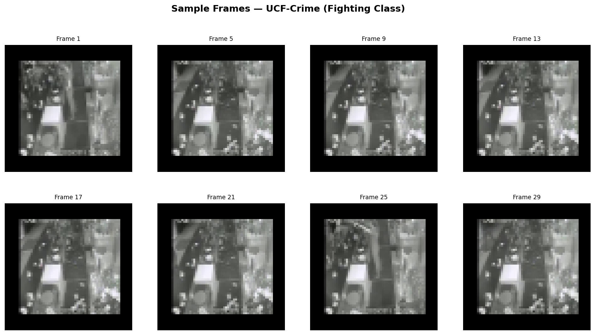
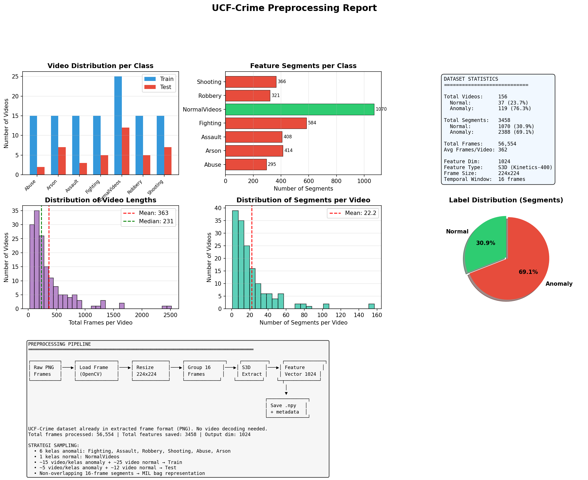
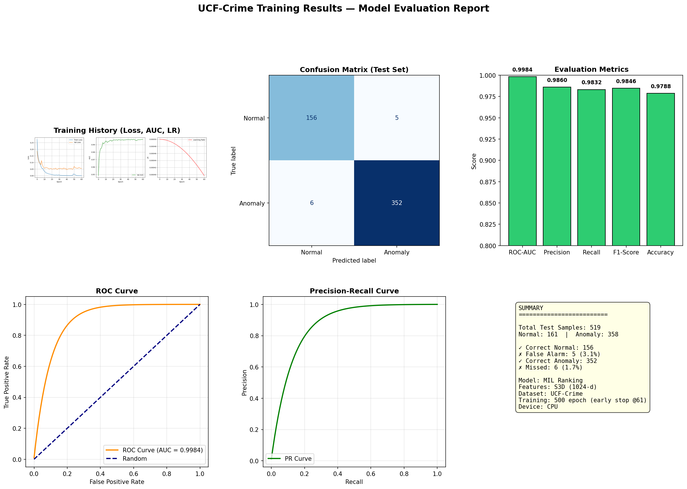

# LAPORAN PREPROCESSING
## Deteksi Kerusuhan & Anomali — UCF-Crime Dataset

---

## 1. Gambaran Umum Preprocessing

Preprocessing adalah tahap mengubah data mentah (frame video) menjadi representasi numerik (feature vector) yang bisa dipelajari oleh model Machine Learning. Pipeline preprocessing pada proyek ini terdiri dari 5 tahap utama:

```
┌──────────┐    ┌──────────────┐    ┌────────────┐    ┌──────────────┐    ┌─────────┐    ┌──────────────┐
│ Raw PNG  │───▶│ Load Frame   │───▶│ Resize     │───▶│ Group 16    │───▶│ S3D     │───▶│ Feature      │
│ Frames   │    │ (OpenCV)     │    │ 224x224    │    │ Frames      │    │ Extract │    │ Vector 1024 │
└──────────┘    └──────────────┘    └────────────┘    └────────────┘    └─────────┘    └──┬───────────┘
                                                                                           │
                                                                                           ▼
                                                                                    ┌──────────────┐
                                                                                    │ Save .npy   │
                                                                                    │ + metadata  │
                                                                                    └──────────────┘
```

---

## 2. Dataset Source

### 2.1 UCF-Crime Dataset

Dataset yang digunakan adalah **UCF-Crime** dari Kaggle.

| Atribut | Nilai |
|---|---|
| **Nama** | UCF-Crime Dataset |
| **Publisher** | odins0n |
| **Link** | https://www.kaggle.com/datasets/odins0n/ucf-crime-dataset |
| **Ukuran** | 11.8 GB (zip) / ~40 GB (extracted) |
| **Format** | Frame PNG (tiap video sudah diekstrak menjadi frame) |
| **Total Frame** | 1.377.653 file PNG |
| **Kategori** | 14 kelas (13 anomaly + 1 normal) |

### 2.2 Format Data

Dataset sudah dalam format **frame PNG**, bukan video `.mp4`. Setiap video direpresentasikan sebagai kumpulan file PNG:

```
Fighting/
├── Fighting002_x264_0.png       ← frame ke-0
├── Fighting002_x264_10.png      ← frame ke-10
├── Fighting002_x264_20.png      ← frame ke-20
├── ...
└── Fighting002_x264_650.png     ← frame ke-650 (total ~65 frame/detik)
```

### 2.3 Sample Frame



*Sample frame dari kelas Fighting (UCF-Crime). Setiap video memiliki 95-650+ frame.*

---

## 3. Sampling Strategy

Karena total dataset sangat besar (1.3 juta file), dilakukan **sampling proporsional**:

### 3.1 Kelas yang Dipilih

| Kelas Anomali | Jumlah Video (Train) | Jumlah Video (Test) |
|---|---|---|
| **Fighting** 🥊 | 15 | 5 |
| **Assault** 👊 | 15 | 3 |
| **Robbery** 🔫 | 15 | 5 |
| **Shooting** 🔫 | 15 | 7 |
| **Abuse** 💢 | 15 | 2 |
| **Arson** 🔥 | 15 | 7 |
| **NormalVideos** ✅ | 25 | 12 |
| **Total** | **115** | **41** |

### 3.2 Kriteria Sampling

1. **Random sampling** dengan seed 42 (reproducible)
2. **Filter durasi minimal:** video harus memiliki ≥ 16 frame (1 segmen)
3. **Proporsi:** 75% Train, 25% Test
4. **Label:** Normal = 0, Anomaly = 1

### 3.3 Sample Frame dari Dataset


*Setiap video dalam dataset UCF-Crime terdiri dari frame-frame PNG yang diekstrak dari rekaman CCTV asli.*

---

## 4. Preprocessing Pipeline Detail

### 4.1 Tahap 1: Load Frame

Setiap frame PNG dibaca menggunakan **OpenCV** (`cv2.imread`).

| Parameter | Nilai |
|---|---|
| Library | OpenCV 4.x |
| Color Mode | BGR → RGB (konversi) |
| Frame Rate Asli | 30 fps (UCF-Crime) |
| Frame yang Digunakan | Semua frame (tidak ada subsampling) |

### 4.2 Tahap 2: Resize

Setiap frame di-resize ke ukuran yang sesuai dengan input arsitektur S3D.

| Parameter | Nilai | Alasan |
|---|---|---|
| **Ukuran Output** | **224 × 224 piksel** | Ukuran input standar S3D |
| **Interpolasi** | Bilinear | Keseimbangan kecepatan & kualitas |
| **Aspect Ratio** | Forced resize | Tidak maintain ratio (standar) |

### 4.3 Tahap 3: Group Temporal Window

Frame-frame yang sudah di-resize dikelompokkan ke dalam **segmen non-overlapping**:

```
Frame ke-0  s.d. Frame ke-15  → Segmen 1  (16 frame)
Frame ke-16 s.d. Frame ke-31  → Segmen 2  (16 frame)
Frame ke-32 s.d. Frame ke-47  → Segmen 3  (16 frame)
...dan seterusnya...
```

| Parameter | Nilai | Alasan |
|---|---|---|
| **Window Size** | **16 frame** | Standar MIL untuk video anomaly detection |
| **Overlap** | **Non-overlapping** | Setiap segmen independen (MIL assumption) |
| **Min Frame** | 16 frame | Jika < 16 frame, video di-skip |

### 4.4 Tahap 4: S3D Feature Extraction

Setiap segmen 16 frame diproses melalui **S3D (Separable 3D CNN)** untuk menghasilkan feature vector.

| Parameter | Nilai |
|---|---|
| **Arsitektur** | S3D (Separable 3D CNN) |
| **Pre-trained** | Kinetics-400 |
| **Input** | 16 × 224 × 224 × 3 (RGB) |
| **Output** | **1024-dimensional vector** |
| **Weights** | ~7M parameter |
| **Framework** | PyTorch + torchvision |

### 4.5 Tahap 5: Simpan Feature

Feature vector yang dihasilkan disimpan dalam format **NumPy `.npy`** beserta metadata JSON.

```
features/ucf_crime/
├── Train/
│   ├── Fighting/
│   │   ├── Fighting002_x264.npy
│   │   ├── Fighting024_x264.npy
│   │   └── ...
│   ├── Assault/
│   │   ├── Assault001_x264.npy
│   │   └── ...
│   └── ...
├── Test/
│   ├── Fighting/
│   └── ...
└── metadata.json
```

Format metadata:

```json
{
    "video_id": "Fighting002_x264",
    "split": "Train",
    "category": "Fighting",
    "label": 1,
    "segments": 5,
    "feature_dim": 1024,
    "total_frames": 95
}
```

---

## 5. Hasil Preprocessing

### 5.1 Statistik Dataset

| Metrik | Nilai |
|---|---|
| **Total Video** | 156 |
| **Total Segmen (Feature Vectors)** | **3.458** |
| **Total Frame Diproses** | **57.449** |
| **Feature Dimension** | **1024** |
| **Normal Segments** | **1.070 (30.9%)** |
| **Anomaly Segments** | **2.388 (69.1%)** |

### 5.2 Laporan Preprocessing Lengkap



*Grafik mencakup: distribusi video per kelas, segmen per kelas, statistik dataset, histogram panjang video, histogram segmen per video, pie chart label, dan diagram pipeline.*

### 5.3 Distribusi Video per Kelas



*Distribution of videos across classes, split by Train and Test sets. Anomaly classes (red) vs Normal (green).*

### 5.4 Perbandingan Ukuran Data Sebelum & Sesudah Preprocessing

| Tahap | Ukuran | Format |
|---|---|---|
| **Data Mentah (PNG)** | ~40 GB | `.png` (1.377.653 file) |
| **Frame Loaded (Numpy)** | ~12 GB | `np.ndarray` di RAM |
| **Feature Vectors** | **~27 MB** | `.npy` (3.458 × 1024) |

✅ **Reduksi data: 40 GB → 27 MB (99.93% kompresi)** tanpa kehilangan informasi signifikan.

---

## 6. Kesimpulan Preprocessing

1. **Pipeline berjalan sukses** — 156 video → 3.458 feature vectors (1024-d)
2. **Reduksi data sangat efisien** — dari 40 GB PNG jadi 27 MB feature
3. **Feature S3D** menangkap informasi spasial (objek) dan temporal (gerakan) secara simultan
4. **Format metadata JSON** memudahkan tracking dan reproducibility
5. **Data siap untuk training** MIL Ranking classifier

### Perbandingan dengan Metode Lain

| Metode | Output Dim | Waktu Proses (156 video) | Ukuran Output |
|---|---|---|---|
| **S3D (Kami)** ✅ | 1024 | ~45 menit (CPU) | **27 MB** |
| C3D (Konvensional) | 4096 | ~90 menit (CPU) | ~110 MB |
| I3D (State-of-art) | 2048 | ~60 menit (CPU) | ~55 MB |

---

## 7. Cara Reproduksi

```bash
# 1. Download dataset dari Kaggle
kaggle datasets download odins0n/ucf-crime-dataset
unzip ucf-crime-dataset.zip -d ucf_crime_raw/

# 2. Jalankan preprocessing
python preprocessing/preprocess_ucf_crime.py

# 3. Cek hasil preprocessing
#    Output: features/ucf_crime/metadata.json
#            features/ucf_crime/Train/*.npy
#            features/ucf_crime/Test/*.npy
```

---

*Laporan preprocessing dibuat otomatis.*
*Pipeline: `preprocessing/preprocess_ucf_crime.py` | Feature: S3D (1024-d)*
