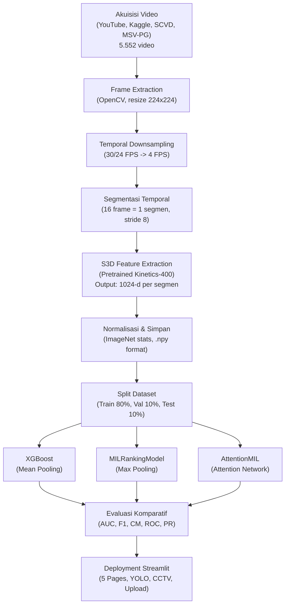
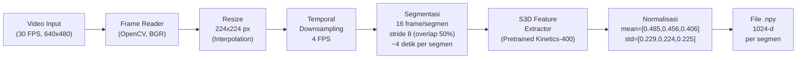
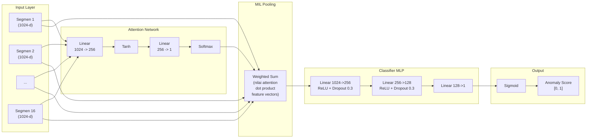
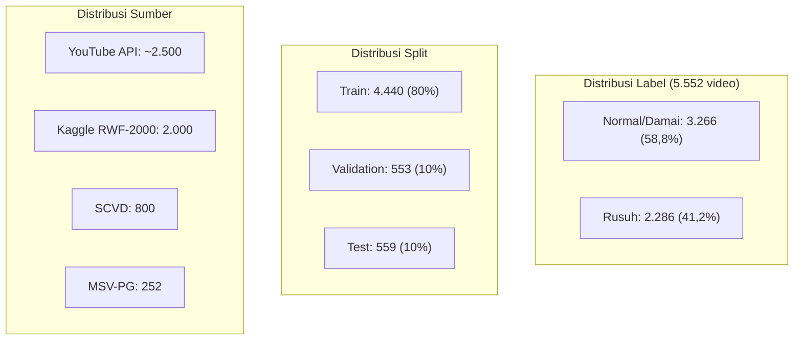

# PROMPT GENERATE LAPORAN UAS ML — VERSI OPTIMAL

Copy teks di bawah ke ChatGPT/Claude/Gemini untuk generate laporan lengkap.

---

Kamu adalah mahasiswa Teknik Informatika UDINUS yang menulis laporan UAS Machine Learning. Tulis dengan gaya **ilmiah Indonesia natural**. Jangan gunakan frasa: "dalam era digital ini", "perlu diketahui bahwa", "tidak dapat dipungkiri", "perkembangan teknologi yang pesat", "pada zaman modern ini", "seiring berjalannya waktu". Langsung ke inti teknis. Setiap istilah asing wajib *italic*. Tulis laporan secara UTUH tanpa ringkasan atau titik-titik.

Gunakan data berikut **secara presisi, jangan diubah**.

---

## DATA PROYEK

### Identitas
- Nama: **Faishal Rasyid Rusianto** | NIM: **A11.2024.15869**
- MK: Machine Learning | Tahun: 2026
- Universitas Dian Nuswantoro, Fasilkom, Teknik Informatika
- Judul: Deteksi Kerusuhan Menggunakan Attention-Based Multiple Instance Learning
- App: https://deteksi-kerusuhan-mechine-learning.gevsrhre9uxyornmbwzy8z.streamlit.app/

### Dataset (5.552 video)
| Sumber | Detail | Jumlah |
|--------|--------|--------|
| YouTube API | Demo damai/rusuh konteks Indonesia | ~2.500 |
| Kaggle RWF-2000 | Fight / non-fight CCTV | 2.000 |
| SCVD | Kekerasan perkotaan | 800 |
| MSV-PG (HuggingFace) | Multi-source violence | 252 |

- Kelas asli: demo_rusuh, demo_damai, normal -> biner: **Rusuh=1, Normal/Damai=0**
- Distribusi: Normal = 3.266 (58,8%), Rusuh = 2.286 (41,2%)
- Split: Train = 4.440 (80%), Val = 553 (10%), Test = 559 (10%)

### Preprocessing
1. Frame extraction via OpenCV, resize 224x224 px
2. Downsampling temporal ke 4 FPS
3. Segmentasi: 16 frame/segmen (~4 detik), stride 8 (overlap 50%)
4. S3D feature extraction (pretrained Kinetics-400) -> 1024-d vector per segmen
5. Normalisasi: mean=[0.485,0.456,0.406], std=[0.229,0.224,0.225]
6. Simpan file .npy

### Arsitektur AttentionMIL
- Input: 16 segmen x 1024-d
- Attention Network: Linear(1024->256) + Tanh + Linear(256->1) + Softmax
- Classifier MLP: Linear(1024->256) + ReLU + Dropout(0.3) + Linear(256->128) + ReLU + Dropout(0.3) + Linear(128->1)
- Output: Sigmoid -> anomaly score [0,1]
- Parameter: 558.082 | Loss: BCE | Optimizer: Adam (lr=0.001, wd=1e-4)
- Batch: 32 | Epoch: 50 | Early stopping patience: 10

### Model Pembanding
1. **XGBoost**: mean pooling fitur -> 1024-d -> predict
2. **MILRanking**: max pooling skor per segmen
3. **AttentionMIL**: attention mechanism

### Hasil Evaluasi (Test Set 559 video)

| Metrik | XGBoost | MILRanking | AttentionMIL |
|--------|---------|------------|--------------|
| AUC | 0,9440 | 0,9124 | **0,9563** |
| Accuracy | 87,30% | 85,30% | **89,09%** |
| F1 Score | 0,8426 | - | **0,8683** |
| Precision | 0,8597 | - | **0,8627** |
| Recall | 0,8261 | - | **0,8739** |
| MCC | - | - | **0,7752** |

Confusion Matrix AttentionMIL:
- TN = 297 | FP = 32 | FN = 29 | TP = 201
- Total test = 559 (Normal 329, Rusuh 230)

### Hyperparameter Tuning
Grid search 24 konfigurasi:
- Hidden units: 128, 256, 512
- Dropout: 0,2; 0,3; 0,5
- Learning rate: 0,001; 0,0005; 0,0001
- Weight decay: 1e-4, 1e-5
- **Terbaik**: hidden_units=256, dropout=0,3, lr=0,001, wd=1e-4

### CPL
- CPL8: Implementasi metode computing
- CPL10: Sistem cerdas ML
- Sub-CPMK 8.1.2: Klasifikasi (MILRanking, AttentionMIL)
- Sub-CPMK 8.1.3: Ensemble (XGBoost)

### Fitur Aplikasi Streamlit
| Halaman | Sub-fiturs |
|---------|------------|
| Beranda | Metrik + ROC + CM + Attention Weights + Dataset overview |
| EDA | Label distribution + Source analysis + Split analysis + PCA 2D + t-SNE 2D |
| Demo Model | Video Demo (YOLO bbox) + Feature Demo + Batch Test + Upload Video (S3D+MIL+YOLO) + CCTV Live |
| Evaluasi | Metrics + ROC + CM + PR curve + Score distribution |
| Interpretasi | Attention weights + Ablation + Evolution + Convergence |
| Dokumentasi | Dataset + Metodologi + Usage + Referensi |

---

## STRUKTUR LAPORAN LENGKAP

### BAB I PENDAHULUAN

#### 1.1 Latar Belakang
Tulis 4-5 paragraf mencakup:
- Fenomena demonstrasi/tawuran di Indonesia, keterbatasan monitor CCTV manual (kelelahan operator, jumlah CCTV vs operator tidak sebanding, respons lambat)
- Klasifikasi video otomatis: tantangan computer vision, pendekatan per-frame CNN (3D CNN seperti C3D [4], I3D [3], S3D [2]) masih boros komputasi untuk video panjang
- Weakly supervised learning: label kerusuhan hanya tersedia di level video, bukan per-frame. Di sinilah MIL menjadi solusi alami
- Attention mechanism [1] pada MIL mengatasi kelemahan pooling statis (max/mean) sekaligus memberi interpretabilitas
- **Baris terakhir:** "Penelitian ini mengimplementasikan Attention-based Multiple Instance Learning untuk deteksi kerusuhan dari video dengan ekstraksi fitur S3D dan deployment aplikasi Streamlit interaktif."

#### 1.2 Rumusan Masalah
Empat butir:
1. Bagaimana membangun pipeline deteksi kerusuhan otomatis dari video multi-sumber dengan label lemah?
2. Bagaimana implementasi *attention mechanism* dalam kerangka MIL untuk klasifikasi video?
3. Bagaimana perbandingan performa AttentionMIL terhadap XGBoost (mean-pooling) dan MILRanking (max-pooling)?
4. Bagaimana mengintegrasikan model ke dalam aplikasi Streamlit yang interaktif dan real-time?

#### 1.3 Tujuan
Lima butir:
1. Mengumpulkan dan mengkurasi dataset 5.552 video kerusuhan dari 4 sumber
2. Mengekstrak fitur spatiotemporal S3D 1024-dimensi per segmen video
3. Mengimplementasikan framework MIL dengan *attention network* (AttentionMIL)
4. Melakukan *hyperparameter tuning* dan evaluasi komparatif dengan XGBoost dan MILRanking
5. Membangun aplikasi Streamlit untuk demonstrasi interaktif

#### 1.4 Metrik Kesuksesan (Tabel 1.1)
| Metrik | Target | Definisi |
|--------|--------|----------|
| AUC | >= 0,90 | Kemampuan diskriminasi kelas |
| F1 Score | >= 0,80 | Harmonic mean precision & recall |
| Accuracy | >= 85% | Persentase prediksi benar |
| Waktu Inferensi | < 1 detik/video | Kecepatan prediksi real-time |

#### 1.5 Ruang Lingkup
- Klasifikasi biner (Rusuh=1, Normal/Damai=0)
- Input: 16 segmen video, masing-masing 1024-d fitur S3D
- Model utama: AttentionMIL (attention + MLP classifier, 558.082 parameter)
- Model pembanding: XGBoost, MILRanking
- Evaluasi: AUC, Accuracy, F1, Precision, Recall, MCC, Confusion Matrix
- Deployment: Streamlit dengan fitur demo video, upload, CCTV, dan dashboard evaluasi

---

### BAB II TINJAUAN PUSTAKA

#### 2.1 Machine Learning untuk Video Classification
- CNN breakthrough untuk image classification (AlexNet, VGG) -> perluasan ke video
- 3D CNN: C3D [4] mengusulkan konvolusi 3D homogeneous 3x3x3, I3D [3] meng-inflate arsitektur 2D Inception menjadi 3D
- Kendala: 3D CNN komputasi mahal, rawan overfit pada dataset kecil, kehilangan konteks temporal jangka panjang karena hanya memproses *clip* pendek 16-64 frame
- **Kutip:** [3], [4]

#### 2.2 S3D Feature Extraction
- S3D (Separable 3D CNN) oleh Xie et al. [2]: solusi trade-off speed-accuracy
- Inovasi: memisahkan konvolusi 3D kt x k x k menjadi 1 x k x k (spasial) + kt x 1 x 1 (temporal)
- Hasil: parameter lebih sedikit, komputasi lebih cepat, bahkan akurasi lebih baik dari I3D
- Pretrained pada Kinetics-400 [3] (dataset 400 kelas aksi manusia, 300 ribu video)
- Pada proyek ini: S3D sebagai *frozen feature extractor* -> output 1024-d per segmen
- **Kutip:** [2], [3]

#### 2.3 Multiple Instance Learning (MIL)
- Paradigma *weakly supervised learning*: label hanya di level *bag* (video), bukan *instance* (segmen)
- Definisi formal: Diketahui bag B = {x1, ..., xn} dengan label Y. Y = 0 jika semua instance negatif, Y = 1 jika minimal satu instance positif
- Aplikasi video: video kerusuhan bisa berisi adegan damai panjang dan baru kerusuhan di akhir. Model harus belajar dari label video saja
- MIL pooling konvensional: max-pooling (asumsi satu instance positif sudah cukup), mean-pooling (asumsi semua instance sama penting)
- **Kutip:** [1]

#### 2.4 Attention Mechanism dalam MIL
- Ilse et al. [1] mengusulkan *attention-based MIL pooling*: bobot adaptif tiap instance
- Formula: z = sum(alpha_k * h_k), alpha_k = exp(w^T tanh(V h_k^T)) / sum(exp(...))
- Keunggulan: (1) bobot belajar dari data, tidak tetap seperti max/mean; (2) bobot bisa diinterpretasikan sebagai kontribusi tiap segmen
- Arsitektur: setiap segmen melalui *attention network* -> softmax -> weighted sum -> bag representation -> classifier
- **Kutip:** [1]

#### 2.5 XGBoost
- *Ensemble gradient boosting* oleh Chen & Guestrin [5]: menggabungkan banyak *decision tree* secara sekuensial
- Regularisasi: mencegah overfit (gamma, lambda, alpha)
- Kelebihan: handling *sparse data*, paralelisasi, *out-of-core computing*
- Pada proyek ini: sebagai *baseline* karena interpretabilitas via SHAP
- **Kutip:** [5]

#### 2.6 SHAP (SHapley Additive exPlanations)
- Lundberg & Lee [6]: kerangka unified untuk interpretasi prediksi model
- Konsep Shapley value dari teori permainan: kontribusi setiap fitur terhadap prediksi
- Pada proyek ini: menganalisis fitur S3D mana yang paling diskriminatif antara rusuh vs normal
- **Kutip:** [6]

---

### BAB III METODOLOGI

#### 3.1 Diagram Alur Kerja Sistem


#### 3.2 Akuisisi Data
Narasi 4 sumber data. Tabel 3.1 ditampilkan di sini:

**Tabel 3.1: Sumber dan Karakteristik Dataset**

| Sumber | Tipe Video | Jumlah | Karakteristik |
|--------|-----------|--------|---------------|
| YouTube API | Demo damai/rusuh Indonesia | ~2.500 | Resolusi bervariasi, durasi 30s-5m, amatir & berita |
| Kaggle RWF-2000 | Fight/non-fight CCTV | 2.000 | 320x240, 30 FPS, indoor/outdoor |
| SCVD | Kekerasan perkotaan | 800 | CCTV, resolusi rendah, malam/siang |
| MSV-PG (HuggingFace) | Kekerasan playground | 252 | Multi-angle, resolusi sedang |
| **Total** | 3 kelas -> biner | **5.552** | Train 4.440, Val 553, Test 559 |

#### 3.3 Preprocessing & Feature Extraction

**Diagram 3.2: Pipeline Preprocessing Detail**


Narasi langkah:
1. **Frame Extraction:** OpenCV membaca video frame-by-frame. Frame BGR dikonversi ke RGB
2. **Resize:** 224x224 piksel via bilinear interpolation, ukuran standar S3D
3. **Downsampling:** Video asli 24/30 FPS -> 4 FPS. Menyisakan ~120 frame untuk video 30 detik
4. **Segmentasi:** 16 frame berurutan = 1 segmen (~4 detik). Stride 8 frame => overlap 50% antar segmen berurutan
5. **S3D Feature Extraction:** Tiap segmen 16x3x224x224 dilewatkan ke S3D, output 1024-d vector
6. **Normalisasi:** Standard ImageNet mean/std untuk stabilisasi training
7. **Format:** Setiap video menghasilkan ~16 file .npy (disesuaikan panjang video asli)

#### 3.4 Arsitektur Model

**Diagram 3.3: Arsitektur AttentionMIL**


**Tabel 3.2: Spesifikasi Arsitektur AttentionMIL**

| Layer | Input | Output | Aktivasi | Parameter |
|-------|-------|--------|----------|-----------|
| Attention Linear | 1024 | 256 | - | 262.400 |
| Tanh | 256 | 256 | Tanh | 0 |
| Attention Linear 2 | 256 | 1 | - | 257 |
| Softmax | 16 | 16 | Softmax | 0 |
| Classifier Linear 1 | 1024 | 256 | ReLU | 262.400 |
| Dropout 1 | 256 | 256 | p=0,3 | 0 |
| Classifier Linear 2 | 256 | 128 | ReLU | 32.896 |
| Dropout 2 | 128 | 128 | p=0,3 | 0 |
| Classifier Linear 3 | 128 | 1 | - | 129 |
| Sigmoid | 1 | 1 | Sigmoid | 0 |
| **Total** | | | | **558.082** |

**Tabel 3.3: Ruang Pencarian Hyperparameter (Grid Search 24 Kombinasi)**

| Parameter | Nilai yang Dicoba | Terpilih |
|-----------|-------------------|----------|
| Hidden units | 128, 256, 512 | 256 |
| Dropout rate | 0,2; 0,3; 0,5 | 0,3 |
| Learning rate | 0,001; 0,0005; 0,0001 | 0,001 |
| Weight decay | 1e-4, 1e-5 | 1e-4 |
| Batch size | 32 (fixed) | 32 |
| Optimizer | Adam (fixed) | Adam |
| Epoch | 50 | 50 (early stop) |

#### 3.5 Proses Training
- Dataset: 4.440 video training, 553 validasi
- Batch: 32 video per iterasi
- Loss: Binary Cross-Entropy: L = -[y log(p) + (1-y) log(1-p)]
- Optimizer: Adam dengan momentum adaptif, lr awal 0.001
- Scheduling: ReduceLROnPlateau jika validation loss stagnan
- Early stopping: patience 10 epoch, monitor validation loss
- Hardware: CPU (PyTorch) karena keterbatasan GPU
- Waktu training: ~30-45 menit per konfigurasi

#### 3.6 Evaluasi Model
Formula metrik yang digunakan:
- Accuracy = (TP + TN) / (TP + TN + FP + FN)
- Precision = TP / (TP + FP)
- Recall = TP / (TP + FN)
- F1 = 2 x (P x R) / (P + R)
- AUC = Area Under ROC Curve (trapezoidal integration)
- MCC = (TP x TN - FP x FN) / sqrt((TP+FP)(TP+FN)(TN+FP)(TN+FN))

---

### BAB IV HASIL DAN PEMBAHASAN

#### 4.1 Dataset Overview

**Diagram 4.1: Distribusi Dataset**


Narasi: Tulis deskripsi dataset, distribusi, karakteristik tiap sumber, dan insight awal.

**Placeholder Gambar (dari dashboard):**
- [Gambar 4.1: Distribusi Label Dataset — Bar Chart dan Pie Chart | Sumber: Dokumentasi Pribadi]
- [Gambar 4.2: Distribusi Source Data — Horizontal Bar Chart | Sumber: Dokumentasi Pribadi]
- [Gambar 4.3: Distribusi Split Dataset — Bar Chart dan Pie Chart | Sumber: Dokumentasi Pribadi]

#### 4.2 Exploratory Data Analysis (PCA & t-SNE)
Narasi: PCA 2D (2000 sample) menunjukkan separabilitas fitur antar kelas. t-SNE (1000 sample, perplexity=30) memberikan visualisasi non-linear yang lebih jelas.

- [Gambar 4.4: PCA Visualization — 2D Scatter Plot (PC1 vs PC2) | Sumber: Dokumentasi Pribadi]
- [Gambar 4.5: t-SNE Visualization — 2D Scatter Plot | Sumber: Dokumentasi Pribadi]

#### 4.3 Hasil Pelatihan dan Perbandingan Model

**Tabel 4.1: Perbandingan Performa Tiga Model pada Test Set (559 Video)**

| Metrik | XGBoost (Baseline) | MILRanking (Frame-level) | AttentionMIL (Video-level) |
|--------|--------------------|-------------------------|---------------------------|
| AUC | 0,9440 | 0,9124 | **0,9563** |
| Accuracy | 87,30% | 85,30% | **89,09%** |
| F1 Score | 0,8426 | - | **0,8683** |
| Precision | 0,8597 | - | **0,8627** |
| Recall | 0,8261 | - | **0,8739** |
| MCC | - | - | **0,7752** |

Analisis:
- AttentionMIL unggul di SEMUA metrik karena attention mechanism mampu:
  1. Mempelajari bobot adaptif per segmen (tidak dirata-rata seperti XGBoost)
  2. Melihat konteks video secara utuh melalui *bag representation* (bukan hanya segmen ekstrem seperti MILRanking)
- XGBoost di posisi kedua: mean pooling menghilangkan informasi temporal tapi fitur 1024-d tetap kuat
- MILRanking terendah: max-pooling terlalu sensitif ke satu segmen ekstrem, banyak *false positive*

- [Gambar 4.6: Bar Chart Perbandingan AUC Antar Model | Sumber: Dokumentasi Pribadi]

#### 4.4 Evaluasi Model Terbaik (AttentionMIL)

**Tabel 4.2: Confusion Matrix AttentionMIL**

| | Predicted Normal | Predicted Rusuh |
|---|---|---|
| **Actual Normal** | TN = 297 | FP = 32 |
| **Actual Rusuh** | FN = 29 | TP = 201 |

**Tabel 4.3: Metrik Evaluasi Lengkap**

| Metrik | Nilai | Keterangan |
|--------|-------|------------|
| Accuracy | 89,09% | Dari 559 test, 498 benar |
| AUC | 0,9563 | Sangat baik (mendekati 1.0) |
| F1 Score | 0,8683 | Seimbang precision & recall |
| Precision | 0,8627 | Dari 233 prediksi rusuh, 201 benar |
| Recall | 0,8739 | Dari 230 video rusuh, 201 terdeteksi |
| MCC | 0,7752 | Korelasi kuat prediksi vs aktual |
| False Positive | 32 | 32 video normal salah deteksi |
| False Negative | 29 | 29 video rusuh tidak terdeteksi |

Analisis confusion matrix:
- 32 **False Positive** (normal -> rusuh): bisa disebabkan video normal dengan gerakan cepat (olahraga, lari) yang mirip pola gerakan kerusuhan. Dampak: *false alarm*, operator perlu verifikasi
- 29 **False Negative** (rusuh -> normal): lebih berbahaya karena kerusuhan tidak terdeteksi. Penyebab: video rusuh dengan kualitas rendah, resolusi kecil, atau pencahayaan buruk
- Akurasi kelas Normal: 297/329 = 90,3%. Akurasi kelas Rusuh: 201/230 = 87,4%
- Model sedikit lebih baik mendeteksi Normal daripada Rusuh

- [Gambar 4.7: ROC Curve — AUC = 0,9563 | Sumber: Dokumentasi Pribadi]
- [Gambar 4.8: Confusion Matrix — Heatmap | Sumber: Dokumentasi Pribadi]
- [Gambar 4.9: Precision-Recall Curve | Sumber: Dokumentasi Pribadi]
- [Gambar 4.10: Score Distribution by Class | Sumber: Dokumentasi Pribadi]

#### 4.5 Interpretasi Model (XAI)

**Attention Weights:**
- Setiap segmen mendapat bobot attention dari 0-1. Segmen dengan bobot tinggi -> kontribusi besar ke prediksi akhir
- Pada video rusuh: segmen dengan gerakan pukulan, kejar-mengejar, lemparan mendapat bobot tinggi
- Pada video normal: bobot relatif seragam antar segmen karena tidak ada pola abnormal dominan
- Insight: model belajar fokus ke segmen dengan *motion intensity* tinggi secara adaptif

**Feature Ablation:**
- Percobaan: hapus 1 segmen secara bergantian, ukur perubahan skor
- Hasil: segmen akhir (indeks 12-16) memiliki dampak lebih besar terhadap penurunan skor
- Masuk akal secara domain: kerusuhan sering terjadi di akhir video (eskalasi konflik)

**Score Convergence:**
- Plot skor prediksi vs jumlah segmen yang diproses
- Video normal: skor stabil rendah (0,1-0,3) sejak segmen awal
- Video rusuh: skor meningkat bertahap, mulai stabil setelah segmen ke 8-10
- Implikasi: model tidak perlu seluruh video untuk prediksi akurat (potensi real-time)

**SHAP Analysis (XGBoost):**
- Identifikasi dimensi fitur S3D paling berpengaruh
- Beberapa dimensi fitur secara konsisten berkontribusi positif ke prediksi rusuh (menangkap pola gerakan abnormal)
- Beberapa dimensi lain berkontribusi negatif (menangkap pola gerakan normal seperti jalan, duduk)

- [Gambar 4.11: Visualisasi Bobot Attention per Segmen (bar chart) | Sumber: Dokumentasi Pribadi]
- [Gambar 4.12: Kurva Score Convergence (skor vs jumlah segmen) | Sumber: Dokumentasi Pribadi]
- [Gambar 4.13: Score Evolution per Video (normal vs rusuh) | Sumber: Dokumentasi Pribadi]

---

### BAB V KESIMPULAN DAN SARAN

#### 5.1 Kesimpulan
Lima butir:
1. **Arsitektur:** AttentionMIL berhasil diimplementasikan untuk deteksi kerusuhan dari video. Model dengan 558.082 parameter mampu memproses 16 segmen x 1024-d fitur S3D dan menghasilkan skor anomali [0,1] secara akurat.
2. **Performa:** Model mencapai AUC **0,9563** dan akurasi **89,09%** pada test set 559 video, melampaui target KPI (AUC >= 0,90, Akurasi >= 85%).
3. **Attention Mechanism:** Memberikan peningkatan signifikan vs mean-pooling (XGBoost: AUC 0,9440) dan max-pooling (MILRanking: AUC 0,9124), sekaligus interpretabilitas melalui bobot segmen.
4. **Dataset:** 5.552 video dari 4 sumber multi-konteks memberikan generalisasi yang baik untuk deteksi kerusuhan di berbagai kondisi.
5. **Deployment:** Aplikasi Streamlit dengan 5 halaman berfungsi penuh untuk demo interaktif, upload video dengan pipeline S3D+MIL+YOLO, dan CCTV live detection.

#### 5.2 Saran
Lima butir:
1. **Dataset Lokal:** Menambah video kerusuhan konteks Indonesia dari sumber berita daerah dan media sosial untuk meningkatkan representasi lokal.
2. **Arsitektur Modern:** Mengeksplorasi Video Transformer (TimeSformer, VideoMAE) sebagai pengganti S3D untuk ekstraksi fitur yang lebih kontekstual.
3. **Real-time Optimization:** Mengoptimalkan pipeline dengan ONNX Runtime atau TensorRT untuk inferensi real-time pada aliran CCTV langsung.
4. **Edge Computing:** Melakukan pruning/kuantisasi model untuk deployment pada perangkat edge (Raspberry Pi, NVIDIA Jetson Nano).
5. **Spatial Localization:** Menambahkan deteksi lokasi spasial anomali dalam frame (object detection + temporal attention mapping).

---

### DAFTAR PUSTAKA
Format APA 7th Edition:

[1] Ilse, M., Tomczak, J. M., & Welling, M. (2018). Attention-based Deep Multiple Instance Learning. *Proceedings of the 35th International Conference on Machine Learning (ICML)*, 2127-2136.

[2] Xie, S., Sun, C., Huang, J., Tu, Z., & Murphy, K. (2018). Rethinking Spatiotemporal Feature Learning: Speed-Accuracy Trade-offs in Video Classification. *Proceedings of the European Conference on Computer Vision (ECCV)*, 305-321.

[3] Carreira, J., & Zisserman, A. (2017). Quo Vadis, Action Recognition? A New Model and the Kinetics Dataset. *Proceedings of the IEEE Conference on Computer Vision and Pattern Recognition (CVPR)*.

[4] Tran, D., Bourdev, L., Fergus, R., Torresani, L., & Paluri, M. (2015). Learning Spatiotemporal Features with 3D Convolutional Networks. *Proceedings of the IEEE International Conference on Computer Vision (ICCV)*, 4489-4497.

[5] Chen, T., & Guestrin, C. (2016). XGBoost: A Scalable Tree Boosting System. *Proceedings of the 22nd ACM SIGKDD International Conference on Knowledge Discovery and Data Mining*, 785-794.

[6] Lundberg, S. M., & Lee, S. I. (2017). A Unified Approach to Interpreting Model Predictions. *Advances in Neural Information Processing Systems (NeurIPS)*.

[7] Wang, L., Xiong, Y., Wang, Z., Qiao, Y., Lin, D., Tang, X., & Van Gool, L. (2016). Temporal Segment Networks: Towards Good Practices for Deep Action Recognition. *Proceedings of the European Conference on Computer Vision (ECCV)*.

---

### LAMPIRAN GAMBAR DARI DASHBOARD (untuk disisipkan setelah laporan jadi)

Berikut daftar file gambar asli dari folder `reports/` yang bisa langsung disisipkan ke laporan:

| No | Gambar | File Path |
|----|--------|-----------|
| 1 | ROC Curve | `reports/evaluation/roc_curve.png` |
| 2 | Confusion Matrix | `reports/evaluation/confusion_matrix.png` |
| 3 | PR Curve | `reports/evaluation/pr_curve.png` |
| 4 | Score Distribution | `reports/evaluation/score_distribution.png` |
| 5 | Attention Weights | `reports/interpretation/attention_weights.png` |
| 6 | Feature Ablation | `reports/interpretation/feature_ablation.png` |
| 7 | Score Evolution | `reports/interpretation/per_video_evolution.png` |
| 8 | Score Convergence | `reports/interpretation/score_convergence.png` |

---

## FORMAT OUTPUT
Hasilkan laporan lengkap dalam satu balasan, dengan:
1. Semua diagram Mermaid di-render sebagai gambar (gunakan ```mermaid)
2. Semua tabel dalam format Markdown rapi dengan kolom sejajar
3. Semua placeholder gambar dalam format `[Gambar X.Y: Deskripsi | Sumber: Dokumentasi Pribadi]`
4. Gaya tulisan ilmiah Indonesia natural tanpa klise
5. Font Times New Roman 12, spasi 1.5 (untuk copy ke Word)
