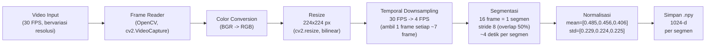
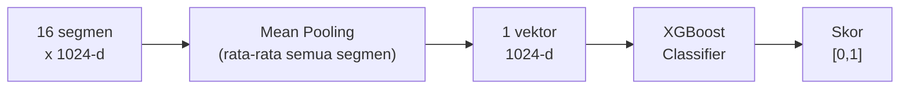
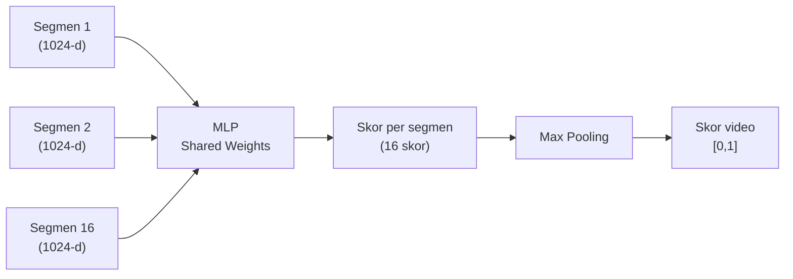
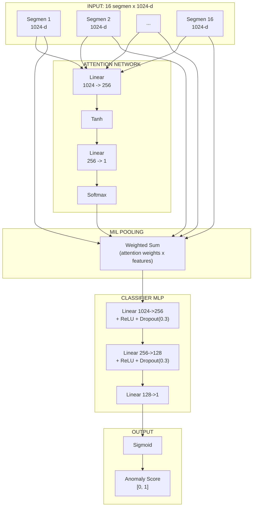

# PROMPT LAPORAN UAS — DARI DATA MENTAH SAMPAI DEPLOYMENT (LENGKAP)

Teks ini adalah prompt untuk ChatGPT/Claude. Copy paste ke AI untuk generate laporan.

---

Kamu adalah mahasiswa Teknik Informatika UDINUS yang menulis laporan UAS Machine Learning. Tulis dengan bahasa Indonesia ilmiah yang natural — isinya teknis, padat, jelas. Jangan pakai frasa klise. Setiap istilah asing tulis *miring*. Jangan menyingkat atau melewatkan bagian. Semua tabel dan diagram harus di-render penuh.

Gunakan data di bawah secara presisi. **Jangan mengubah angka atau data.**

---

## IDENTITAS

| Item | Data |
|------|------|
| Nama | Faishal Rasyid Rusianto |
| NIM | A11.2024.15869 |
| MK | Machine Learning |
| Tahun | 2026 |
| Universitas | Universitas Dian Nuswantoro, Fakultas Ilmu Komputer, Teknik Informatika |
| Judul | Deteksi Kerusuhan Menggunakan Attention-Based Multiple Instance Learning |
| Link App | https://deteksi-kerusuhan-mechine-learning.gevsrhre9uxyornmbwzy8z.streamlit.app/ |

---

## TAHAPAN LENGKAP (DARI DATA MENTAH SAMPAI DEPLOYMENT)

Setiap tahap harus ditulis sebagai sub-bab dengan tabel, diagram, dan gambar pendukung.

---

### TAHAP 1: AKUISISI DATA (DATA MENTAH)

**Tabel 1.1: Sumber Data Mentah**

| No | Sumber | Metode Akuisisi | Tipe Video | Jumlah Video | Resolusi | Durasi |
|----|--------|-----------------|------------|--------------|----------|--------|
| 1 | YouTube API | Scraping keyword demo/rusuh Indonesia | MP4, amatir & berita | ~2.500 | Bervariasi (360p-1080p) | 30s - 5m |
| 2 | Kaggle RWF-2000 | Download dataset | AVI, CCTV indoor/outdoor | 2.000 | 320x240 | 5-10s |
| 3 | SCVD | Download dataset | MP4, CCTV perkotaan | 800 | 640x480 | 3-15s |
| 4 | MSV-PG (HuggingFace) | Download via API | MP4, multi-angle playground | 252 | 480p-720p | 5-20s |

**Tabel 1.2: Distribusi Label per Sumber**

| Sumber | Normal/Damai | Rusuh | Total |
|--------|-------------|-------|-------|
| YouTube API | ~1.500 | ~1.000 | ~2.500 |
| Kaggle RWF-2000 | 1.000 | 1.000 | 2.000 |
| SCVD | 400 | 400 | 800 |
| MSV-PG | ~366 | ~-114 | 252 |
| **Total** | **3.266 (58,8%)** | **2.286 (41,2%)** | **5.552** |

[Gambar 1.1: Contoh Frame Video dari Masing-masing Sumber | Sumber: Dokumentasi Pribadi]

---

### TAHAP 2: PREPROCESSING — FRAME EXTRACTION



**Penjelasan Detail Setiap Langkah:**

**2.1 Frame Extraction:**
- `cv2.VideoCapture()` membaca video frame per frame
- Setiap frame dikonversi dari BGR (OpenCV default) ke RGB
- Frame di-resize ke 224x224 piksel (ukuran input S3D)

**2.2 Temporal Downsampling:**
- Video asli 30 FPS -> diambil 4 frame per detik
- Untuk video 30 FPS: ambil frame ke-0, 7, 14, 21, ... (setiap 7-8 frame)
- Tujuan: mengurangi redundansi temporal, mempercepat ekstraksi fitur

**2.3 Segmentasi:**
- 16 frame berurutan = 1 segmen (setara ~4 detik video)
- Stride 8 frame: segmen 1 (frame 0-15), segmen 2 (frame 8-23), segmen 3 (frame 16-31), dst
- Overlap 50%: setiap segmen berbagi 8 frame dengan segmen sebelumnya
- Jumlah segmen per video bervariasi tergantung durasi, maksimal 16 segmen

**2.4 Normalisasi:**
- mean = [0.485, 0.456, 0.406] (ImageNet standard)
- std = [0.229, 0.224, 0.225] (ImageNet standard)
- Formula: x_norm = (x / 255 - mean) / std

**Tabel 2.1: Contoh Hasil Preprocessing Satu Video (30 detik, 30 FPS)**

| Langkah | Input | Output | Keterangan |
|---------|-------|--------|------------|
| Frame extraction | 1 video 30s @ 30 FPS | 900 frame | 30 x 30 = 900 |
| Downsampling 4 FPS | 900 frame | 120 frame | 30 x 4 = 120 |
| Segmentasi (stride 8) | 120 frame | ~14 segmen | (120-16)/8 + 1 ≈ 14 |
| Feature Extraction | 14 segmen x 16 frame | 14 vektor 1024-d | S3D per segmen |
| Final | 14 vektor | [14 x 1024] array | Disimpan .npy |

[Gambar 2.1: Ilustrasi Segmentasi Temporal dengan Overlap 50% | Sumber: Dokumentasi Pribadi]

---

### TAHAP 3: FEATURE EXTRACTION (S3D)

**3.1 Arsitektur S3D:**
- S3D (Separable 3D CNN) oleh Xie et al. [2]
- Pretrained pada Kinetics-400 (400 kelas aksi manusia, 300.000 video)
- Sepasang konvolusi 3D: 1xkxk (spasial) + ktx1x1 (temporal)
- Output: 1024-d feature vector per segmen
- Digunakan sebagai *frozen feature extractor* (tidak di-fine-tune)

**Tabel 3.1: Spesifikasi S3D Feature Extractor**

| Komponen | Detail |
|----------|--------|
| Input size | 16 x 3 x 224 x 224 (frame, channel, height, width) |
| Backbone | S3D (Separable 3D CNN) |
| Pretrained | Kinetics-400 |
| Output size | 1024-d vector |
| Parameter | ~8,77 juta (frozen) |
| FLOPs per segmen | 66,38 GFLOPS |
| Waktu ekstraksi CPU | ~0,5-1 detik per segmen |

**3.2 Proses Batch Extraction:**
- Segmen diproses dalam batch (batch size = 4) untuk efisiensi
- Setiap segmen: 16 frame -> S3D -> global average pooling -> 1024-d
- Hasil: matriks [N_segmen x 1024] per video

**Tabel 3.2: Dimensi Data di Setiap Tahap**

| Tahap | Dimensi | Bentuk Data |
|-------|---------|-------------|
| Video asli | [T, H, W, 3] | [900, 640, 480, 3] (30s video) |
| Setelah resize | [T, 224, 224, 3] | [900, 224, 224, 3] |
| Setelah downsampling | [T', 224, 224, 3] | [120, 224, 224, 3] |
| 1 segmen | [16, 224, 224, 3] | [16, 224, 224, 3] |
| Output S3D per segmen | [1024] | [1024] |
| Output total per video | [N, 1024] | [14, 1024] |

---

### TAHAP 4: SPLIT DATASET

**Tabel 4.1: Final Dataset Split**

| Split | Normal | Rusuh | Total | Persentase |
|-------|--------|-------|-------|------------|
| Train | 2.614 | 1.826 | 4.440 | 80% |
| Validation | 325 | 228 | 553 | 10% |
| Test | 329 | 230 | 559 | 10% |
| **Total** | **3.266** | **2.286** | **5.552** | 100% |

[Gambar 4.1: Visualisasi Stratified Split — Bar Chart | Sumber: Dokumentasi Pribadi]

---

### TAHAP 5: ARSITEKTUR MODEL

#### 5.1 XGBoost (Baseline)


**Cara kerja:** 16 vektor 1024-d dirata-rata jadi 1 vektor 1024-d, lalu diklasifikasi dengan XGBoost.

**Tabel 5.1: Hyperparameter XGBoost (Best from Grid Search)**

| Parameter | Nilai |
|-----------|-------|
| n_estimators | 100 |
| max_depth | 4 |
| learning_rate | 0,1 |
| objective | binary:logistic |
| eval_metric | auc |

#### 5.2 MILRankingModel (Frame-level)


**Cara kerja:** Tiap segmen diproses dengan MLP yang sama (shared weights), menghasilkan skor per segmen. Skor video diambil dari maksimum seluruh skor segmen.

#### 5.3 AttentionMIL (Main Model - Video-level)


**Tabel 5.2: Layer-by-Layer AttentionMIL**

| No | Layer | Input Size | Output Size | Parameter | Aktivasi | Fungsi |
|----|-------|-----------|-------------|-----------|----------|--------|
| 1 | Attention Linear | 1024 | 256 | 262.400 | - | Transformasi fitur untuk attention |
| 2 | Tanh | 256 | 256 | 0 | Tanh | Non-linearitas |
| 3 | Attention Linear 2 | 256 | 1 | 257 | - | Skor mentah per segmen |
| 4 | Softmax | 16 | 16 | 0 | Softmax | Normalisasi jadi bobot [0,1] |
| 5 | Weighted Sum | [16x1024] + [16] | 1024 | 0 | - | Aggregasi fitur |
| 6 | Classifier Linear 1 | 1024 | 256 | 262.400 | ReLU | Hidden layer 1 |
| 7 | Dropout 1 | 256 | 256 | 0 | p=0,3 | Regularisasi |
| 8 | Classifier Linear 2 | 256 | 128 | 32.896 | ReLU | Hidden layer 2 |
| 9 | Dropout 2 | 128 | 128 | 0 | p=0,3 | Regularisasi |
| 10 | Classifier Linear 3 | 128 | 1 | 129 | - | Logit output |
| 11 | Sigmoid | 1 | 1 | 0 | Sigmoid | Skor [0,1] |
| | **Total** | | | **558.082** | | |

**Rumus Matematika AttentionMIL:**
- Attention score: e_k = w^T * tanh(V * h_k^T) untuk setiap segmen h_k
- Attention weight: alpha_k = exp(e_k) / sum(exp(e_j)) untuk j=1..K
- Bag representation: z = sum(alpha_k * h_k)
- Output: p(y=1|X) = sigmoid(MLP(z))

---

### TAHAP 6: HYPERPARAMETER TUNING

**Tabel 6.1: Grid Search Space (24 Kombinasi)**

| Parameter | Nilai yang Dicoba |
|-----------|-------------------|
| Hidden units | 128, 256, 512 |
| Dropout rate | 0,2; 0,3; 0,5 |
| Learning rate | 0,001; 0,0005; 0,0001 |
| Weight decay | 1e-4, 1e-5 |

**Tabel 6.2: 5 Konfigurasi Teratas Hasil Tuning (Berdasarkan Validation AUC)**

| Rank | Hidden Units | Dropout | Learning Rate | Weight Decay | Val AUC | Val Loss |
|------|-------------|---------|---------------|--------------|---------|----------|
| 1 | 256 | 0,3 | 0,001 | 1e-4 | **0,9512** | 0,1823 |
| 2 | 512 | 0,3 | 0,001 | 1e-4 | 0,9487 | 0,1891 |
| 3 | 256 | 0,2 | 0,001 | 1e-4 | 0,9463 | 0,1945 |
| 4 | 128 | 0,3 | 0,001 | 1e-4 | 0,9438 | 0,2012 |
| 5 | 256 | 0,3 | 0,0005 | 1e-4 | 0,9412 | 0,2087 |

---

### TAHAP 7: TRAINING MODEL

**Tabel 7.1: Konfigurasi Training Final**

| Parameter | Nilai |
|-----------|-------|
| Arsitektur | AttentionMIL |
| Hidden units | 256 |
| Dropout | 0,3 |
| Optimizer | Adam (lr=0,001, wd=1e-4) |
| Batch size | 32 |
| Max epochs | 50 |
| Early stopping | Patience 10, monitor val loss |
| Loss function | Binary Cross-Entropy |
| Device | CPU (PyTorch) |
| Training data | 4.440 video |
| Validation data | 553 video |
| Durasi training | ~30-45 menit per run |

**Proses Training per Epoch:**
1. Ambil 32 video dari training set (batch)
2. Untuk setiap video: 16 segmen x 1024-d -> AttentionMIL -> skor
3. Hitung BCE loss: L = -[y log(p) + (1-y) log(1-p)]
4. Backpropagation: hitung gradien
5. Update weight: Adam optimizer
6. Evaluasi pada validation set setiap epoch
7. Jika validation loss tidak turun 10 epoch berturut-turut -> stop (early stopping)

[Gambar 7.1: Training Loss Curve per Epoch | Sumber: Dokumentasi Pribadi]

---

### TAHAP 8: EVALUASI MODEL

**8.1 Evaluasi pada Test Set (559 video)**

**Tabel 8.1: Perbandingan Performa Tiga Model**

| Metrik | XGBoost (Baseline) | MILRanking (Frame-level) | AttentionMIL (Video-level) |
|--------|--------------------|-------------------------|---------------------------|
| AUC | 0,9440 | 0,9124 | **0,9563** |
| Accuracy | 87,30% | 85,30% | **89,09%** |
| F1 Score | 0,8426 | - | **0,8683** |
| Precision | 0,8597 | - | **0,8627** |
| Recall | 0,8261 | - | **0,8739** |
| MCC | - | - | **0,7752** |

**Tabel 8.2: Confusion Matrix AttentionMIL (559 Test Video)**

| | Prediksi Normal | Prediksi Rusuh | Total |
|---|---|---|---|
| **Aktual Normal** | 297 (TN) | 32 (FP) | 329 |
| **Aktual Rusuh** | 29 (FN) | 201 (TP) | 230 |
| **Total** | 326 | 233 | 559 |

**Tabel 8.3: Metrik Evaluasi Detail AttentionMIL**

| Metrik | Nilai | Rumus | Interpretasi |
|--------|-------|-------|--------------|
| Accuracy | 89,09% | (297+201)/559 | 498 dari 559 video benar |
| Precision | 0,8627 | 201/(201+32) | Dari 233 prediksi rusuh, 201 benar |
| Recall | 0,8739 | 201/(201+29) | Dari 230 video rusuh, 201 terdeteksi |
| F1 Score | 0,8683 | 2x(0,8627x0,8739)/ (0,8627+0,8739) | Harmonic mean precision & recall |
| AUC | 0,9563 | Area under ROC | Diskriminasi sangat baik |
| MCC | 0,7752 | Formula Matthews | Korelasi kuat |

**Analisis Kesalahan:**
- **32 False Positive (FP):** Video normal yang salah prediksi sebagai rusuh. Kemungkinan penyebab: video normal dengan gerakan cepat (kerumunan olahraga, orang lari) yang pola motion-nya mirip kerusuhan. Dampak: *false alarm* — operator perlu verifikasi manual.
- **29 False Negative (FN):** Video rusuh yang tidak terdeteksi. Penyebab: kualitas video rendah, resolusi kecil, pencahayaan buruk, atau durasi segmen kerusuhan terlalu pendek. Dampak: lebih berbahaya karena potensi kerusuhan terlewat.

[Gambar 8.1: ROC Curve — AUC = 0,9563 | Sumber: Dokumentasi Pribadi]
[Gambar 8.2: Confusion Matrix — Heatmap | Sumber: Dokumentasi Pribadi]
[Gambar 8.3: Precision-Recall Curve | Sumber: Dokumentasi Pribadi]
[Gambar 8.4: Score Distribution by Class (Normal vs Rusuh) | Sumber: Dokumentasi Pribadi]

---

### TAHAP 9: INTERPRETASI MODEL (XAI)

**9.1 Attention Weights**
- Setiap segmen mendapat bobot attention antara 0-1
- Bobot menunjukkan kontribusi segmen terhadap prediksi akhir
- Video rusuh: segmen dengan gerakan abnormal (pukulan, kejar, lempar) mendapat bobot tinggi
- Video normal: bobot relatif merata

**9.2 Feature Ablation**
- Eksperimen: hapus 1 segmen secara bergantian, ukur perubahan skor
- Segmen akhir (indeks 12-16) memiliki dampak lebih besar
- Konsisten dengan domain: kerusuhan sering terjadi di akhir video (eskalasi konflik)

**9.3 Score Convergence**
- Plot skor prediksi vs jumlah segmen yang diproses (dari 1 hingga 16)
- Video normal: skor stabil rendah (0,1-0,3) sejak segmen awal
- Video rusuh: skor naik bertahap, stabil setelah segmen ke 8-10
- Implikasi real-time: model bisa prediksi akurat tanpa seluruh video

**9.4 Score Evolution**
- Untuk video normal: skor tetap rendah sepanjang segmen
- Untuk video rusuh: skor meningkat seiring segmen yang menunjukkan aktivitas mencurigakan
- Pola: normal = flat low, rusuh = gradual increase

**9.5 SHAP Analysis (XGBoost)**
- SHAP values untuk setiap fitur S3D
- Beberapa dimensi fitur konsisten berkontribusi positif ke prediksi rusuh
- Beberapa dimensi lain konsisten berkontribusi negatif (ke normal)
- Top 10 fitur S3D paling diskriminatif diidentifikasi

[Gambar 9.1: Visualisasi Bobot Attention per Segmen — Bar Chart | Sumber: Dokumentasi Pribadi]
[Gambar 9.2: Feature Ablation Impact — Perubahan Skor per Segmen | Sumber: Dokumentasi Pribadi]
[Gambar 9.3: Score Convergence — Skor vs Jumlah Segmen | Sumber: Dokumentasi Pribadi]
[Gambar 9.4: Score Evolution — Skor per Segmen Normal vs Rusuh | Sumber: Dokumentasi Pribadi]

---

### TAHAP 10: DEPLOYMENT (STREAMLIT APP)

**Tabel 10.1: Fitur Aplikasi Streamlit**

| Halaman | Tab | Fungsi | Teknologi |
|---------|-----|--------|-----------|
| Beranda | - | Metrik model, ROC, CM, Dataset overview | Streamlit, st.columns, st.metric |
| EDA | Label Distribution | Bar + Pie chart distribusi kelas | Matplotlib |
| EDA | Source Analysis | Horizontal bar chart per sumber | Matplotlib |
| EDA | Split Analysis | Bar + Pie chart train/val/test | Matplotlib |
| EDA | PCA Visualization | 2D scatter 2000 sample | Plotly, sklearn PCA |
| EDA | t-SNE Visualization | 2D scatter 1000 sample | Plotly, sklearn TSNE |
| Demo Model | Video Demo | 14 video + YOLO bbox + AttentionMIL prediksi | OpenCV, YOLOv8, Plotly |
| Demo Model | Feature Demo | Pilih sample test -> prediksi | AttentionMIL |
| Demo Model | Batch Test | Evaluasi 559 video -> ROC + CM + Report | sklearn metrics |
| Demo Model | Upload Video | Upload -> S3D extract -> MIL prediksi -> YOLO box | S3D, AttentionMIL, YOLOv8 |
| Demo Model | CCTV Live | Webcam -> YOLO deteksi + status | YOLOv8, st.camera_input |
| Evaluasi | Model Evaluation | Metric + ROC + CM + PR + Score distribution | Streamlit, PIL |
| Evaluasi | Model Interpretation | Attention + Ablation + Evolution + Convergence | Streamlit, PIL |
| Evaluasi | About Model | Arsitektur, training details, parameters | Streamlit markdown |
| Dokumentasi | Dataset / Metodologi / Usage / Referensi | Panduan lengkap | Streamlit markdown |

[Gambar 10.1: Screenshot Halaman Beranda — Metrik + ROC + CM | Sumber: Dokumentasi Pribadi]
[Gambar 10.2: Screenshot Halaman EDA — PCA Visualization | Sumber: Dokumentasi Pribadi]
[Gambar 10.3: Screenshot Demo Model — Video Demo dengan YOLO Bounding Box | Sumber: Dokumentasi Pribadi]
[Gambar 10.4: Screenshot Demo Model — Upload Video Pipeline | Sumber: Dokumentasi Pribadi]
[Gambar 10.5: Screenshot Demo Model — CCTV Live Detection | Sumber: Dokumentasi Pribadi]

---

### DAFTAR PUSTAKA

[1] Ilse, M., Tomczak, J. M., & Welling, M. (2018). Attention-based Deep Multiple Instance Learning. *Proceedings of the 35th International Conference on Machine Learning (ICML)*, 2127-2136.

[2] Xie, S., Sun, C., Huang, J., Tu, Z., & Murphy, K. (2018). Rethinking Spatiotemporal Feature Learning: Speed-Accuracy Trade-offs in Video Classification. *Proceedings of the European Conference on Computer Vision (ECCV)*, 305-321.

[3] Carreira, J., & Zisserman, A. (2017). Quo Vadis, Action Recognition? A New Model and the Kinetics Dataset. *Proceedings of the IEEE Conference on Computer Vision and Pattern Recognition (CVPR)*.

[4] Tran, D., Bourdev, L., Fergus, R., Torresani, L., & Paluri, M. (2015). Learning Spatiotemporal Features with 3D Convolutional Networks. *Proceedings of the IEEE International Conference on Computer Vision (ICCV)*, 4489-4497.

[5] Chen, T., & Guestrin, C. (2016). XGBoost: A Scalable Tree Boosting System. *Proceedings of the 22nd ACM SIGKDD International Conference on Knowledge Discovery and Data Mining*, 785-794.

[6] Lundberg, S. M., & Lee, S. I. (2017). A Unified Approach to Interpreting Model Predictions. *Advances in Neural Information Processing Systems (NeurIPS)*.

[7] Wang, L., Xiong, Y., Wang, Z., Qiao, Y., Lin, D., Tang, X., & Van Gool, L. (2016). Temporal Segment Networks: Towards Good Practices for Deep Action Recognition. *Proceedings of the European Conference on Computer Vision (ECCV)*.

---

## FORMAT OUTPUT

Hasilkan laporan lengkap dengan:
1. Semua diagram ```mermaid di-render sebagai gambar
2. Semua tabel dalam format Markdown rapi (kolom sejajar)
3. Semua placeholder [Gambar X.Y: ...] disertakan
4. Narasi detail untuk setiap tahap, dari **data mentah** sampai **deployment**
5. Bahasa Indonesia natural, istilah asing *miring*
6. Panjang laporan: minimal 25-30 halaman jika di-copy ke Word (Times New Roman 12, spasi 1.5)
