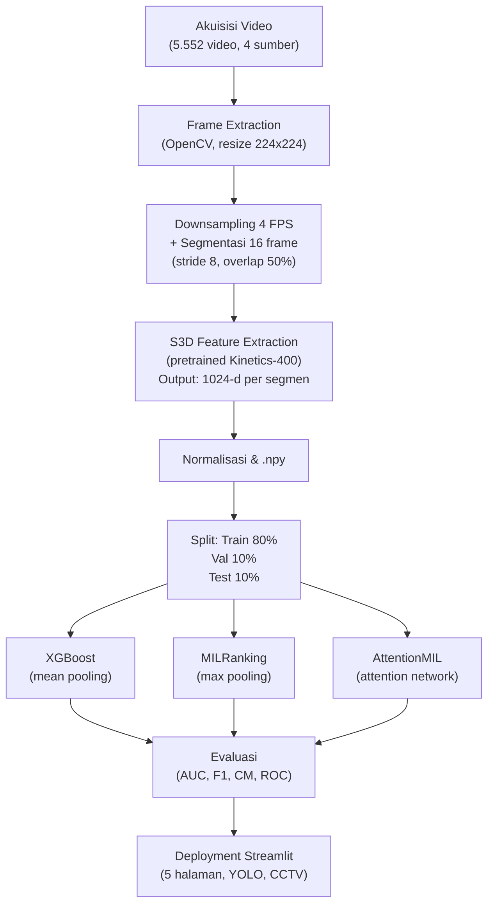
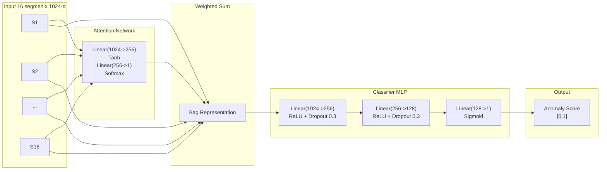

# PROMPT LAPORAN UAS MACHINE LEARNING

Copy paste teks di bawah ke ChatGPT/Claude untuk generate laporan lengkap.

---

Kamu adalah mahasiswa Teknik Informatika UDINUS yang sedang menulis laporan UAS Machine Learning. Tulis dengan gaya bahasa ilmiah Indonesia yang natural, seperti tulisan mahasiswa yang benar-benar mengerjakan proyek ini. Jangan gunakan frasa klise (dalam era digital, tidak dapat dipungkiri, perkembangan teknologi yang pesat, dsb). Langsung ke inti.

Gunakan data di bawah secara presisi. Setiap istilah asing tulis *miring*. Jangan tambah atau kurangi angka.

---

## IDENTITAS
**Nama:** Faishal Rasyid Rusianto | **NIM:** A11.2024.15869
**Mata Kuliah:** Machine Learning | **Tahun:** 2026
**Institusi:** Universitas Dian Nuswantoro, Fakultas Ilmu Komputer, Teknik Informatika
**Judul:** Deteksi Kerusuhan Menggunakan Attention-Based Multiple Instance Learning
**Link App:** https://deteksi-kerusuhan-mechine-learning.gevsrhre9uxyornmbwzy8z.streamlit.app/

---

## DATA TEKNIS (WAJIB, JANGAN DIUBAH)

### Dataset
- **5.552 video** dari 4 sumber: YouTube API (~2.500), Kaggle RWF-2000 (2.000), SCVD (800), MSV-PG (252)
- 3 kelas asli (demo_rusuh, demo_damai, normal) -> biner: **Rusuh=1, Normal/Damai=0**
- Normal: 3.266 (58,8%), Rusuh: 2.286 (41,2%)
- Split: Train 4.440 (80%) | Val 553 (10%) | Test 559 (10%)

### Preprocessing Pipeline
1. Frame extraction OpenCV -> resize 224x224
2. Temporal downsampling 4 FPS
3. Segmentasi: 16 frame/segmen, stride 8 (overlap 50%)
4. S3D feature extraction (pretrained Kinetics-400) -> **1024-d per segmen**
5. Normalisasi: mean=[0.485,0.456,0.406], std=[0.229,0.224,0.225]
6. Simpan .npy

### Arsitektur AttentionMIL
- **Input:** 16 segmen x 1024-d
- **Attention Network:** Linear(1024->256) + Tanh + Linear(256->1) + Softmax
- **Classifier MLP:** Linear(1024->256) + ReLU + Dropout(0.3) + Linear(256->128) + ReLU + Dropout(0.3) + Linear(128->1)
- **Output:** Sigmoid -> anomaly score [0,1]
- **Total parameter:** 558.082
- **Loss:** BCE | **Optimizer:** Adam (lr=0.001, wd=1e-4) | **Batch:** 32 | **Epoch:** 50 (early stopping patience=10)

### Model Pembanding
1. **XGBoost:** mean pooling 16 segmen -> 1024-d -> predict
2. **MILRanking:** tiap segmen independen -> max pooling
3. **AttentionMIL:** attention mechanism (model utama)

### Hasil Evaluasi (Test Set 559 Video)

| Metrik | XGBoost | MILRanking | AttentionMIL |
|--------|---------|------------|--------------|
| AUC | 0.9440 | 0.9124 | **0.9563** |
| Accuracy | 87.30% | 85.30% | **89.09%** |
| F1 Score | 0.8426 | - | **0.8683** |
| Precision | 0.8597 | - | **0.8627** |
| Recall | 0.8261 | - | **0.8739** |
| MCC | - | - | **0.7752** |

**Confusion Matrix AttentionMIL:** TN=297, FP=32, FN=29, TP=201

### Hyperparameter Tuning
Grid search 24 kombinasi: hidden_units (128,256,512), dropout (0.2,0.3,0.5), lr (0.001,0.0005,0.0001), weight_decay (1e-4,1e-5)
**Terbaik:** hidden_units=256, dropout=0.3, lr=0.001, wd=1e-4

### CPL
- CPL8: Implementasi metode computing (MIL untuk deteksi kerusuhan)
- CPL10: Sistem cerdas ML (aplikasi Streamlit)
- Sub-CPMK 8.1.2: Klasifikasi (MILRanking, AttentionMIL)
- Sub-CPMK 8.1.3: Ensemble learning (XGBoost)

---

## STRUKTUR LAPORAN

### BAB I — PENDAHULUAN
1. **Latar Belakang** (3-4 paragraf):
   - Masalah deteksi kerusuhan di Indonesia, keterbatasan monitor CCTV manual
   - Tantangan klasifikasi video: 3D CNN [3][4] mahal komputasi, pendekatan per-frame kehilangan konteks temporal
   - Solusi MIL + attention [1]: label lemah cocok untuk video, attention lebih baik dari pooling statis
   - Penelitian ini mengimplementasikan AttentionMIL dengan S3D feature extraction

2. **Rumusan Masalah** (4 butir):
   - Bagaimana pipeline deteksi kerusuhan dengan label lemah?
   - Bagaimana implementasi *attention mechanism* pada MIL?
   - Bagaimana performa AttentionMIL vs XGBoost dan MILRanking?
   - Bagaimana integrasi ke aplikasi Streamlit?

3. **Tujuan** (5 butir): akuisisi dataset, ekstraksi S3D, implementasi MIL, tuning, deployment

4. **Metrik Kesuksesan**:
   | Metrik | Target |
   |--------|--------|
   | AUC | >= 0.90 |
   | F1 Score | >= 0.80 |
   | Accuracy | >= 85% |
   | Waktu Inferensi | < 1 detik/video |

5. **Ruang Lingkup**: biner, 16 segmen, S3D 1024-d, AttentionMIL, evaluasi AUC/F1/CM, Streamlit

### BAB II — TINJAUAN PUSTAKA
Tulis dengan sitasi [1]-[7]:

| Topik | Isi | Sitasi |
|-------|-----|--------|
| Video Classification | C3D, I3D, 3D CNN, keterbatasan per-frame | [3][4] |
| S3D Feature Extraction | Separable 3D CNN, pretrained Kinetics-400, output 1024-d | [2][3] |
| Multiple Instance Learning | Bag-instance, weakly supervised, MIL pooling | [1] |
| Attention Mechanism | Attention-based MIL pooling, bobot adaptif, interpretability | [1] |
| XGBoost | Gradient boosting, regularisasi, handling sparse data | [5] |
| SHAP | Shapley value, unified feature attribution | [6] |

### BAB III — METODOLOGI

#### 3.1 Diagram Alur Kerja


#### 3.2 Diagram Arsitektur AttentionMIL


#### 3.3 Narasi Metodologi
- **Akuisisi Data:** Detail 4 sumber (YouTube API scraped, Kaggle RWF-2000, SCVD, MSV-PG). Tabel sumber dan jumlah.
- **Preprocessing:** Langkah detail (frame extraction -> resize -> downsampling -> segmentasi -> S3D -> normalisasi -> .npy). Input video 30 FPS 640x480 -> representasi 16 vektor 1024-d.
- **Arsitektur Model:** Tiga model dengan spesifikasi. Tabel layer AttentionMIL dengan parameter (total 558.082).
- **Hyperparameter Tuning:** Grid search 24 konfigurasi. Tabel parameter yang di-tuning.
- **Evaluasi:** Definisi metrik (AUC, F1, Precision, Recall, MCC, CM).

### BAB IV — HASIL DAN PEMBAHASAN

#### 4.1 Dataset Overview
- 5.552 video, 4 sumber, 2 kelas biner
- [Gambar 4.1: Distribusi Label — Bar Chart & Pie Chart | Sumber: Dokumentasi Pribadi]
- [Gambar 4.2: Distribusi Source Data — Horizontal Bar Chart | Sumber: Dokumentasi Pribadi]
- [Gambar 4.3: Distribusi Split — Bar Chart & Pie Chart | Sumber: Dokumentasi Pribadi]

#### 4.2 EDA
- PCA (2000 sample) dan t-SNE (1000 sample)
- [Gambar 4.4: PCA Visualization | Sumber: Dokumentasi Pribadi]
- [Gambar 4.5: t-SNE Visualization | Sumber: Dokumentasi Pribadi]

#### 4.3 Perbandingan Model
Tampilkan **Tabel Perbandingan** lengkap (XGBoost, MILRanking, AttentionMIL). Analisis:
- AttentionMIL unggul karena attention mechanism mempelajari bobot adaptif (tidak rata seperti mean-pooling XGBoost)
- MILRanking terendah karena max-pooling terlalu sensitif ke satu segmen ekstrem
- XGBoost di tengah karena fitur S3D tetap informatif meski dirata-rata

[Gambar 4.6: Bar Chart Perbandingan AUC | Sumber: Dokumentasi Pribadi]

#### 4.4 Evaluasi Model Terbaik
Confusion Matrix:
| | Pred Normal | Pred Rusuh |
|---|---|---|
| Actual Normal | 297 | 32 |
| Actual Rusuh | 29 | 201 |

- Akurasi: 89.09% (498/559)
- AUC: 0.9563
- FP=32: 32 video normal terdeteksi rusuh (false alarm, operator perlu verifikasi)
- FN=29: 29 video rusuh tidak terdeteksi (lebih berbahaya, potensi kerusuhan terlewatkan)

[Gambar 4.7: ROC Curve (AUC=0.9563) | Sumber: Dokumentasi Pribadi]
[Gambar 4.8: Confusion Matrix Heatmap | Sumber: Dokumentasi Pribadi]
[Gambar 4.9: Precision-Recall Curve | Sumber: Dokumentasi Pribadi]
[Gambar 4.10: Score Distribution by Class | Sumber: Dokumentasi Pribadi]

#### 4.5 Interpretasi
- **Attention Weights:** model fokus ke segmen dengan gerakan abnormal
- **Feature Ablation:** segmen akhir lebih penting
- **Score Convergence:** stabil setelah 8-10 segmen
- **SHAP Analysis:** fitur S3D paling diskriminatif

[Gambar 4.11: Attention Weights per Segment | Sumber: Dokumentasi Pribadi]
[Gambar 4.12: Feature Ablation Impact | Sumber: Dokumentasi Pribadi]
[Gambar 4.13: Score Convergence | Sumber: Dokumentasi Pribadi]
[Gambar 4.14: Score Evolution per Video | Sumber: Dokumentasi Pribadi]

### BAB V — KESIMPULAN DAN SARAN

#### 5.1 Kesimpulan (5 butir)
1. AttentionMIL berhasil diimplementasikan, input 16 segmen x 1024-d, parameter 558.082
2. AUC 0.9563, akurasi 89.09% — melampaui target KPI
3. Attention mechanism unggul vs mean-pooling (XGBoost) dan max-pooling (MILRanking)
4. Dataset 5.552 video multi-source memberikan generalisasi baik
5. Aplikasi Streamlit berfungsi penuh untuk demo interaktif

#### 5.2 Saran (5 butir)
1. Tambah dataset kerusuhan konteks Indonesia
2. Eksplorasi Video Transformer (TimeSformer, VideoMAE)
3. Optimasi real-time dengan ONNX/TensorRT
4. Deployment edge (Raspberry Pi, Jetson)
5. Lokalisasi spasial anomali dalam frame

### DAFTAR PUSTAKA
[1] Ilse, M., Tomczak, J. M., & Welling, M. (2018). Attention-based Deep Multiple Instance Learning. *ICML*, 2127-2136.
[2] Xie, S., Sun, C., Huang, J., Tu, Z., & Murphy, K. (2018). Rethinking Spatiotemporal Feature Learning. *ECCV*, 305-321.
[3] Carreira, J., & Zisserman, A. (2017). Quo Vadis, Action Recognition? A New Model and the Kinetics Dataset. *CVPR*.
[4] Tran, D., Bourdev, L., Fergus, R., Torresani, L., & Paluri, M. (2015). Learning Spatiotemporal Features with 3D Convolutional Networks. *ICCV*, 4489-4497.
[5] Chen, T., & Guestrin, C. (2016). XGBoost: A Scalable Tree Boosting System. *ACM SIGKDD*, 785-794.
[6] Lundberg, S. M., & Lee, S. I. (2017). A Unified Approach to Interpreting Model Predictions. *NeurIPS*.
[7] Wang, L., et al. (2016). Temporal Segment Networks: Towards Good Practices for Deep Action Recognition. *ECCV*.

---

## FORMAT

Hasilkan laporan lengkap dalam satu balasan. Semua diagram ```mermaid harus di-render. Semua tabel dalam format Markdown rapi. Gunakan bahasa Indonesia baku natural, variasi kalimat, tanpa klise AI. Siap copy-paste ke Word (Times New Roman 12, spasi 1.5).
