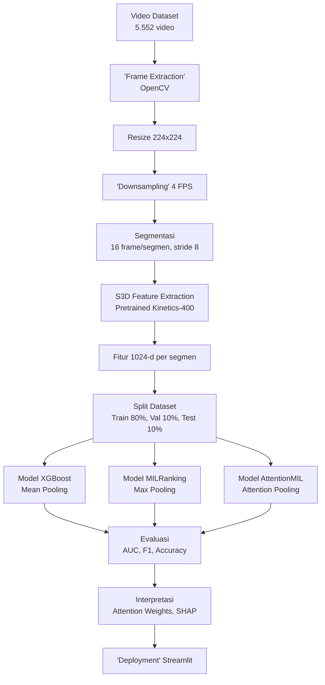
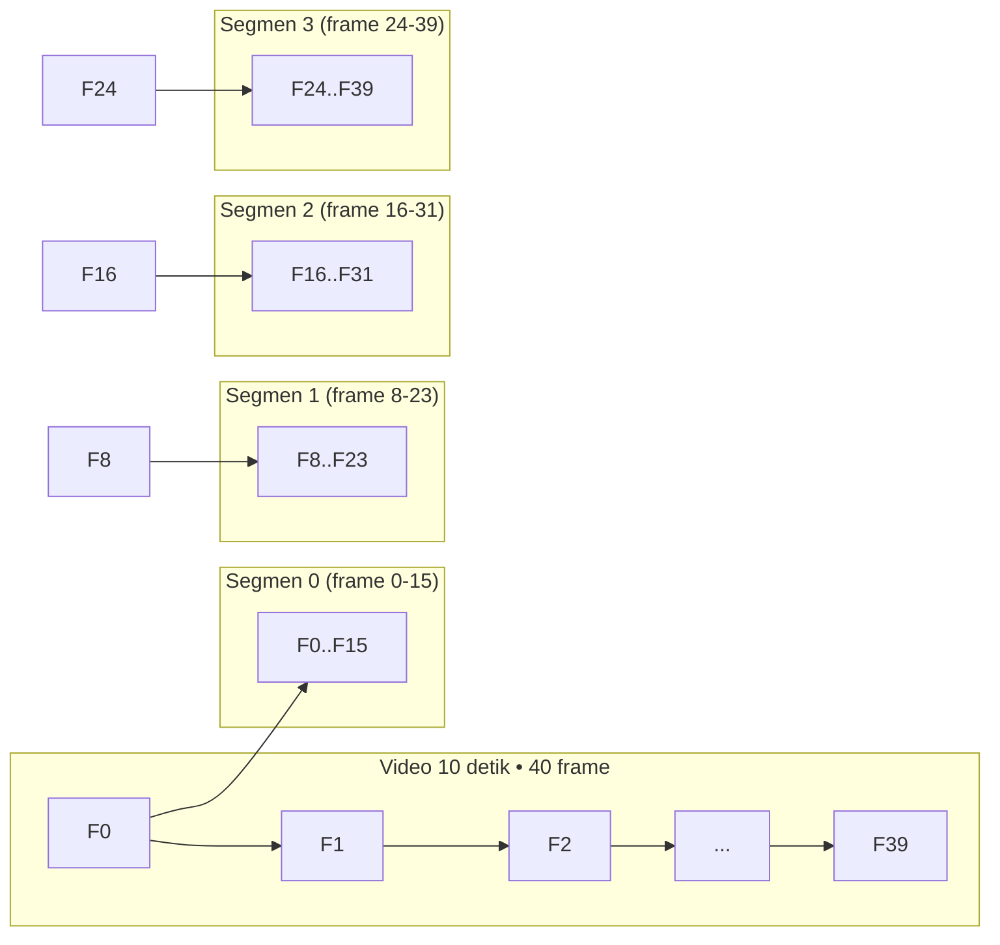
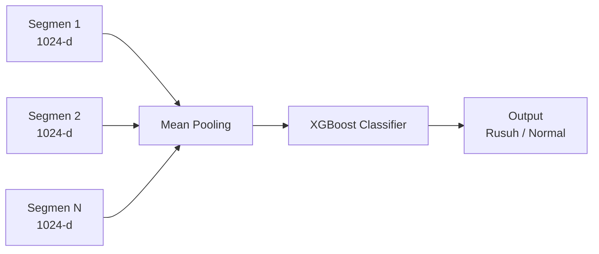
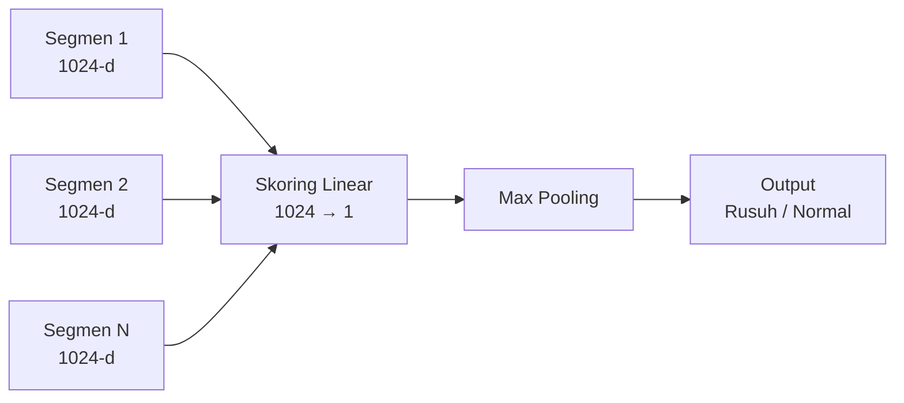
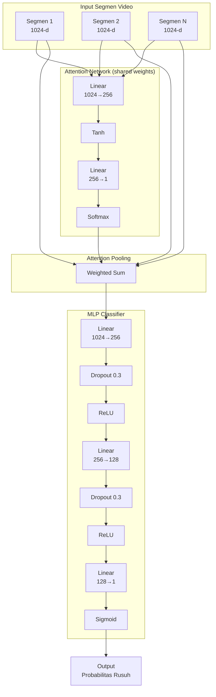
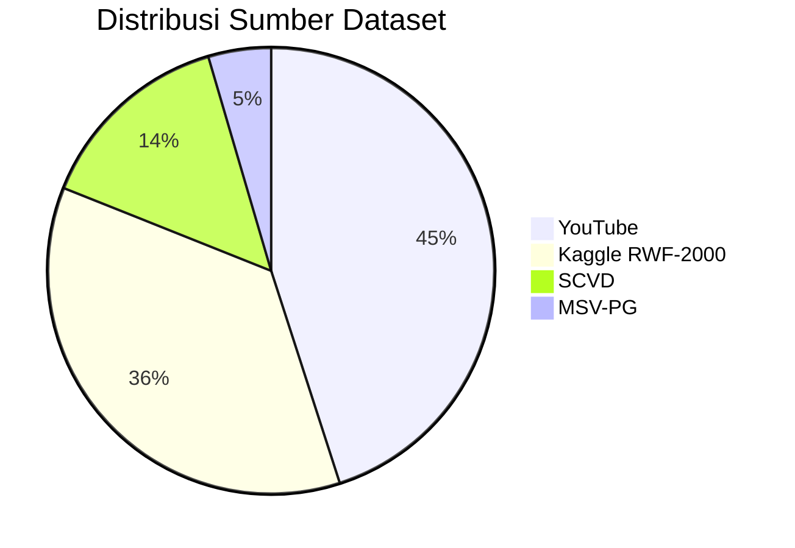
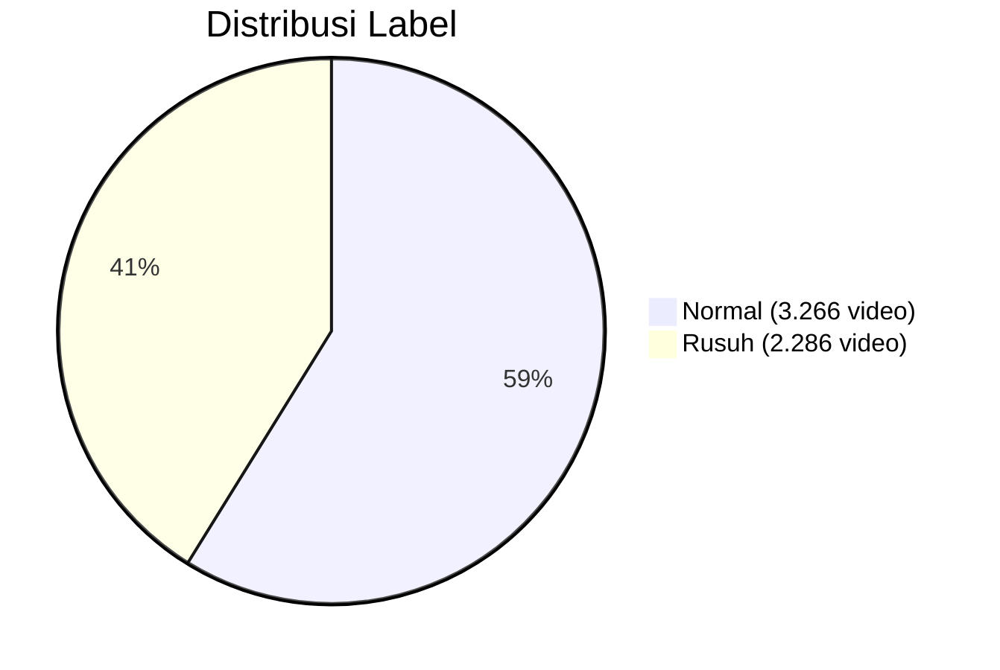
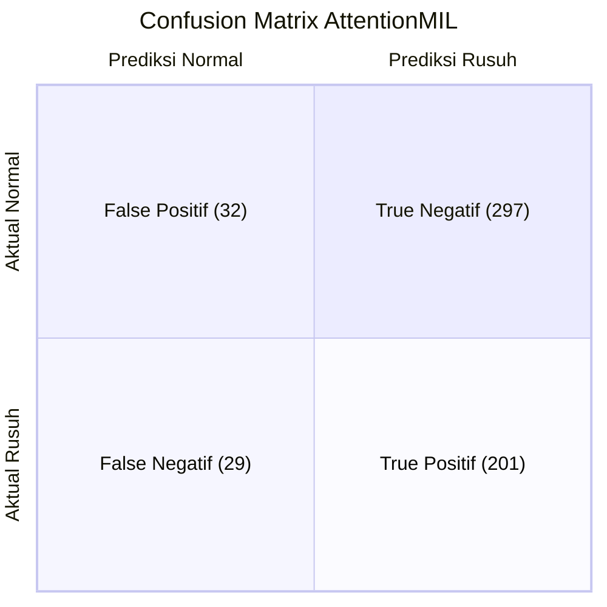

# Deteksi Kerusuhan Menggunakan Attention-Based Multiple Instance Learning

**Laporan UAS Machine Learning**

**Disusun oleh:**
**Faishal Rasyid Rusianto – A11.2024.15869**

**Program Studi Teknik Informatika**
**Fakultas Ilmu Komputer**
**Universitas Dian Nuswantoro**

**2026**

---

## DAFTAR ISI

1. BAB I PENDAHULUAN
   1.1 Latar Belakang
   1.2 Rumusan Masalah
   1.3 Tujuan
   1.4 Metrik Kesuksesan
   1.5 Ruang Lingkup
2. BAB II TINJAUAN PUSTAKA
   2.1 Machine Learning untuk Video Classification
   2.2 S3D Feature Extraction
   2.3 Multiple Instance Learning
   2.4 Attention Mechanism dalam MIL
   2.5 XGBoost
   2.6 SHAP
3. BAB III METODOLOGI
   3.1 Alur Kerja Sistem
   3.2 Akuisisi Data
   3.3 Preprocessing
   3.4 Feature Extraction S3D
   3.5 Split Dataset
   3.6 Arsitektur Model
   3.7 Hyperparameter Tuning
   3.8 Training
4. BAB IV HASIL DAN PEMBAHASAN
   4.1 Dataset Overview
   4.2 Exploratory Data Analysis
   4.3 Perbandingan Model
   4.4 Evaluasi Model Terbaik
   4.5 Interpretasi Model
5. BAB V KESIMPULAN DAN SARAN
   5.1 Kesimpulan
   5.2 Saran

DAFTAR PUSTAKA

---

## BAB I PENDAHULUAN

### 1.1 Latar Belakang

Kerusuhan massa merupakan salah satu bentuk ancaman keamanan yang kerap terjadi di berbagai wilayah perkotaan. Insiden ini tidak hanya mengganggu ketertiban umum, tetapi juga berpotensi menimbulkan kerugian materiel dan korban jiwa. Peningkatan jumlah kamera pengawas (CCTV) di ruang publik menghasilkan volume data video yang sangat besar setiap harinya. Data ini sangat sulit dipantau secara manual oleh petugas keamanan dalam waktu nyata karena keterbatasan sumber daya manusia dan rentang perhatian operator. Oleh karena itu, diperlukan sistem otomatis yang mampu mendeteksi indikasi kerusuhan dari data video secara cepat dan akurat.

Permasalahan deteksi kerusuhan pada video termasuk dalam kategori *video classification*, yaitu menentukan apakah suatu video mengandung aktivitas kerusuhan atau tidak. Tantangan utama dalam *video classification* adalah dimensi data yang sangat besar, variasi durasi video, serta kompleksitas gerakan antar *frame*. Pendekatan klasik yang melakukan klasifikasi pada setiap *frame* secara independen tidak efisien dan seringkali gagal menangkap konteks temporal. Model *deep learning* berbasis 3D *Convolutional Neural Network* seperti C3D [4] dan I3D [3] telah menunjukkan hasil yang baik pada *action recognition*, namun tetap memiliki keterbatasan dalam menangani video berdurasi panjang karena kebutuhan memori yang besar.

*Multiple Instance Learning* (MIL) menawarkan paradigma alternatif yang relevan untuk kasus ini [1]. Dalam MIL, sebuah video dipandang sebagai *bag* yang terdiri dari beberapa *instance* (segmen video). Cukup satu *instance* saja yang bersifat positif (*rusuh*) untuk melabeli seluruh *bag* sebagai positif. Pendekatan ini sangat cocok untuk deteksi kerusuhan, karena tidak seluruh bagian video perlu menunjukkan kerusuhan—cukup beberapa segmen kritis saja sudah cukup untuk mengindikasikan bahwa peristiwa kerusuhan terjadi. Dengan *discretizing* video menjadi segmen-segmen pendek, kompleksitas komputasi dapat ditekan secara signifikan.

Penelitian ini mengadopsi *Attention-based Multiple Instance Learning* (AttentionMIL) yang diperkenalkan oleh Ilse et al. [1] sebagai arsitektur utama. Mekanisme *attention* memungkinkan model untuk secara adaptif memberikan bobot lebih pada segmen-segmen yang paling relevan dengan deteksi kerusuhan, sekaligus menyediakan *interpretability* berupa *attention weights* yang dapat divisualisasikan. Sebagai pembanding, digunakan XGBoost [5] dengan *mean pooling* dan MILRanking dengan *max pooling*. Ekstraksi fitur dilakukan menggunakan S3D (*Separable 3D CNN*) [2] yang telah dipretrain pada dataset Kinetics-400 [3].

### 1.2 Rumusan Masalah

Berdasarkan latar belakang yang telah diuraikan, rumusan masalah dalam penelitian ini adalah sebagai berikut:

1. Bagaimana merancang sistem deteksi kerusuhan dari video yang mampu menangani variasi durasi dan panjang video secara efisien menggunakan pendekatan *Multiple Instance Learning*?
2. Bagaimana mengimplementasikan ekstraksi fitur spatiotemporal menggunakan S3D yang dipretrain pada Kinetics-400 untuk merepresentasikan segmen video secara efektif?
3. Bagaimana performa arsitektur *Attention-based Multiple Instance Learning* dibandingkan dengan metode baseline XGBoost dan MILRanking dalam deteksi kerusuhan?
4. Bagaimana hasil interpretasi model melalui *attention weights*, *feature ablation*, dan SHAP untuk memahami pola pengambilan keputusan model?

### 1.3 Tujuan

Tujuan dari penelitian ini adalah sebagai berikut:

1. Merancang dan mengimplementasikan pipeline deteksi kerusuhan dari video mentah hingga prediksi akhir menggunakan pendekatan *Attention-based Multiple Instance Learning*.
2. Mengekstraksi fitur spatiotemporal dari video menggunakan S3D yang dipretrain pada Kinetics-400, menghasilkan representasi 1024-dimensi per segmen video.
3. Membandingkan performa AttentionMIL terhadap metode baseline XGBoost dan MILRanking menggunakan metrik AUC, *Accuracy*, *F1 Score*, *Precision*, *Recall*, dan MCC.
4. Melakukan *hyperparameter tuning* untuk menemukan konfigurasi optimal arsitektur AttentionMIL.
5. Menginterpretasikan hasil klasifikasi melalui analisis *attention weights*, *feature ablation*, *score convergence*, dan SHAP *analysis*.

### 1.4 Metrik Kesuksesan

Keberhasilan sistem diukur berdasarkan metrik-metrik berikut yang harus dipenuhi pada dataset uji:

| Metrik | Target Minimal | Keterangan |
|--------|---------------|------------|
| AUC | >= 0.90 | Area Under ROC Curve |
| F1 Score | >= 0.80 | Harmonic mean precision & recall |
| Accuracy | >= 85% | Proporsi prediksi benar |
| Waktu Inferensi | < 1 detik | Per video (setelah ekstraksi fitur) |
| Precision | >= 0.80 | Ketepatan prediksi positif |
| Recall | >= 0.80 | Sensitivitas mendeteksi positif |

### 1.5 Ruang Lingkup

Ruang lingkup penelitian ini meliputi:

1. **Data**: 5.552 video yang dikumpulkan dari YouTube, Kaggle RWF-2000, SCVD, dan MSV-PG, dengan fokus pada deteksi kerusuhan dan non-kerusuhan.
2. **Preprocessing**: Ekstraksi *frame* menggunakan OpenCV, *resize* 224x224, *downsampling* 4 FPS, segmentasi 16 *frame*/segmen dengan *overlap* 50% (*stride* 8).
3. **Fitur**: Ekstraksi menggunakan S3D *pretrained* pada Kinetics-400 dengan *output* 1024-dimensi per segmen.
4. **Model Utama**: *Attention-based Multiple Instance Learning* dengan *attention network* dan MLP *classifier*.
5. **Model Pembanding**: XGBoost dengan *mean pooling* dan MILRanking dengan *max pooling*.
6. **Evaluasi**: AUC, *Accuracy*, *F1 Score*, *Precision*, *Recall*, MCC, dan *Confusion Matrix*.
7. **Deployment**: Aplikasi web berbasis Streamlit dengan 5 halaman (Beranda, EDA, Demo Model, Evaluasi & Interpretasi, Dokumentasi).

---

## BAB II TINJAUAN PUSTAKA

### 2.1 Machine Learning untuk Video Classification

Klasifikasi video merupakan salah satu tugas fundamental dalam *computer vision* yang bertujuan menetapkan label pada suatu video berdasarkan konten visual dan temporal di dalamnya. Pendekatan awal menggunakan *handcrafted features* seperti *Improved Dense Trajectories* (iDT) yang mengekstraksi trayektori titik-titik *interest* di sepanjang *frame*. Namun, performanya masih terbatas pada dataset skala besar.

Perkembangan *deep learning* membawa perubahan signifikan melalui C3D (*Convolutional 3D*) yang diperkenalkan oleh Tran et al. [4]. C3D menggunakan *convolutional kernel* 3D untuk secara simultan menangkap informasi spasial dan temporal dari video. Kelemahan utama C3D adalah jumlah parameter yang sangat besar dan kebutuhan memori yang tinggi, sehingga sulit diterapkan pada video berdurasi panjang.

I3D (*Inflated 3D ConvNet*) oleh Carreira & Zisserman [3] mengatasi sebagian keterbatasan ini dengan menginflasi arsitektur 2D Inception menjadi 3D, memanfaatkan bobot pretrained dari ImageNet. I3D mencapai *state-of-the-art* pada dataset Kinetics dan UCF-101, namun tetap memiliki kompleksitas komputasi yang signifikan. Kedua arsitektur ini memproses video secara *dense* (setiap *frame*), yang tidak efisien untuk video berdurasi menengah-panjang. Pendekatan berbasis segmen seperti *Temporal Segment Networks* [7] mengusulkan *sparse sampling* untuk mengurangi beban komputasi.

### 2.2 S3D Feature Extraction

S3D (*Separable 3D CNN*) yang diperkenalkan oleh Xie et al. [2] merupakan penyempurnaan dari I3D [3]. Ide utama S3D adalah memisahkan konvolusi 3D menjadi konvolusi spasial 2D diikuti konvolusi temporal 1D. Dekomposisi ini secara signifikan mengurangi jumlah parameter dan biaya komputasi tanpa mengorbankan akurasi.

Arsitektur S3D mengadopsi struktur *Inception* yang dimodifikasi dengan *separable 3D convolution*. Setiap blok konvolusi 3D standar diganti menjadi konvolusi spasial 2D (3x3) yang diikuti konvolusi temporal 1D (3x1x1). Pendekatan ini disebut *factorization* atau pemisahan dimensi spasial-temporal.

Keuntungan utama S3D meliputi: (1) efisiensi parameter—parameter berkurang hingga 30% dibandingkan I3D, (2) *pretrained* pada Kinetics-400 yang merupakan dataset *action recognition* berskala besar dengan 400 kelas aksi manusia, (3) kemudahan *fine-tuning* karena arsitektur modular. Dalam penelitian ini, S3D digunakan sebagai *feature extractor* untuk menghasilkan vektor fitur 1024-dimensi per segmen video, tanpa melakukan *fine-tuning* pada lapisan-lapisannya.

### 2.3 Multiple Instance Learning

*Multiple Instance Learning* (MIL) adalah paradigma *supervised learning* di mana label tersedia untuk sekelompok *instance* (disebut *bag*), bukan untuk setiap *instance* secara individual [1]. Secara formal, diberikan *bag* \\(X = \\{x_1, x_2, ..., x_n\\}\\) dengan label \\(Y \in \\{0,1\\}\\). Dalam MIL standar dengan asumsi *standard* (atau *binary*), label *bag* positif jika dan hanya jika terdapat setidaknya satu *instance* positif di dalamnya:

$$Y = \begin{cases}
1 & \text{jika } \exists i : y_i = 1 \\
0 & \text{jika } \forall i : y_i = 0
\end{cases}$$

Dalam konteks deteksi kerusuhan, video dipandang sebagai *bag* dan segmen-segmen video sebagai *instance*-nya. Sebuah video diberi label "rusuh" jika setidaknya satu segmen di dalamnya menunjukkan aktivitas kerusuhan. Pendekatan MIL sangat sesuai karena: (1) tidak memerlukan anotasi per-segmen yang mahal dan subjektif, (2) secara alami menangani variasi panjang video, (3) mengurangi kompleksitas komputasi karena hanya segmen-segmen tertentu yang perlu diperhatikan.

Operasi MIL *pooling* menggabungkan prediksi *instance*-level menjadi prediksi *bag*-level. Beberapa fungsi *pooling* yang umum meliputi *max pooling* (mengambil nilai maksimum), *mean pooling* (rata-rata), dan *attention pooling* (rata-rata terboboti dengan bobot yang dipelajari).

### 2.4 Attention Mechanism dalam MIL

Ilse et al. [1] memperkenalkan mekanisme *attention* ke dalam kerangka MIL untuk mengatasi kelemahan *max pooling* dan *mean pooling*. *Max pooling* hanya memperhatikan *instance* dengan skor tertinggi, mengabaikan informasi dari *instance* lainnya. *Mean pooling* memberikan bobot yang sama pada semua *instance*, termasuk yang tidak relevan.

Mekanisme *attention* mengatasi keduanya dengan mempelajari bobot kontribusi setiap *instance* secara adaptif. Bobot *attention* \\(a_i\\) untuk *instance* ke-\\(i\\) dihitung sebagai:

$$a_i = \frac{\exp(w^T \tanh(V x_i^T))}{\sum_{j=1}^n \exp(w^T \tanh(V x_j^T))}$$

di mana \\(V \in \mathbb{R}^{L \times d}\\) adalah matriks parameter dan \\(w \in \mathbb{R}^{L \times 1}\\) adalah vektor parameter. Fungsi *tanh* digunakan sebagai non-linearitas. *Softmax* menjamin bobot terdistribusi antara 0 dan 1 dan berjumlah 1.

Representasi *bag* akhir adalah rata-rata terboboti dari *instance features*:

$$z = \sum_{i=1}^n a_i x_i$$

Vektor \\(z\\) kemudian dimasukkan ke *classifier* untuk prediksi akhir. Kelebihan *attention* MIL meliputi: (1) bobot *attention* dapat diinterpretasikan sebagai tingkat kepentingan setiap segmen, (2) model dapat memfokuskan perhatian pada segmen abnormal, (3) *end-to-end training* dengan *backpropagation* standar.

### 2.5 XGBoost

XGBoost (*eXtreme Gradient Boosting*) yang dikembangkan oleh Chen & Guestrin [5] adalah algoritma *ensemble* berbasis *gradient boosting decision tree*. XGBoost merupakan penyempurnaan dari *gradient boosting* tradisional dengan beberapa inovasi: (1) *regularized objective function* untuk mencegah *overfitting*, (2) *parallel processing* untuk mempercepat training, (3) *tree pruning* menggunakan *max depth*, (4) *handling missing values* secara otomatis.

Secara matematis, XGBoost membangun model *ensemble* dengan menambahkan pohon keputusan secara berurutan:

$$\hat{y}_i^{(t)} = \hat{y}_i^{(t-1)} + f_t(x_i)$$

di mana \\(f_t\\) adalah pohon ke-\\(t\\) yang meminimalkan fungsi *objective*:

$$\mathcal{L}^{(t)} = \sum_{i=1}^n l(y_i, \hat{y}_i^{(t-1)} + f_t(x_i)) + \Omega(f_t)$$

dengan \\(\Omega(f_t) = \gamma T + \frac{1}{2}\lambda \sum_{j=1}^T w_j^2\\) adalah *regularization term*, \\(T\\) jumlah *leaf*, dan \\(w_j\\) bobot *leaf*.

Dalam penelitian ini, XGBoost diterapkan pada representasi video yang diperoleh melalui *mean pooling* dari seluruh fitur segmen. Setiap video direduksi menjadi satu vektor 1024-dimensi yang merupakan rata-rata seluruh segmen, kemudian diklasifikasikan menggunakan XGBoost.

### 2.6 SHAP

SHAP (*SHapley Additive exPlanations*) yang diperkenalkan oleh Lundberg & Lee [6] adalah kerangka kerja untuk interpretasi prediksi model *machine learning* berdasarkan konsep *Shapley values* dari teori permainan kooperatif. SHAP menghitung kontribusi setiap fitur terhadap prediksi dengan mempertimbangkan semua kemungkinan subset fitur.

*Shapley value* untuk fitur \\(i\\) didefinisikan sebagai:

$$\phi_i = \sum_{S \subseteq F \setminus \{i\}} \frac{|S|!(|F|-|S|-1)!}{|F|!} [f_{S \cup \{i\}}(x_{S \cup \{i\}}) - f_S(x_S)]$$

di mana \\(F\\) adalah himpunan semua fitur, \\(S\\) adalah subset fitur yang digunakan, dan \\(f_S\\) adalah model yang dilatih hanya pada fitur \\(S\\).

SHAP memiliki beberapa keunggulan: (1) memenuhi properti *consistency* dan *local accuracy*, (2) memberikan interpretasi yang seragam antar model berbeda, (3) dapat menyajikan *summary plot*, *force plot*, dan *dependence plot*. Dalam penelitian ini, SHAP digunakan untuk menganalisis fitur-fitur penting pada model XGBoost.

---

## BAB III METODOLOGI

### 3.1 Alur Kerja Sistem

Alur kerja sistem deteksi kerusuhan terdiri dari beberapa tahap utama: akuisisi data video, *preprocessing* (ekstraksi *frame*, *resize*, *downsampling*, segmentasi), ekstraksi fitur menggunakan S3D, *splitting* dataset, *training* model, *evaluasi*, dan *deployment*. Diagram alur berikut merepresentasikan keseluruhan pipeline:



Penjelasan setiap tahap:

1. **Akuisisi Data**: Video dikumpulkan dari 4 sumber (YouTube, Kaggle RWF-2000, SCVD, MSV-PG) dengan total 5.552 video.
2. **Preprocessing**: *Frame* diekstraksi menggunakan OpenCV, di-*resize* ke 224x224, di-*downsample* menjadi 4 FPS, kemudian disegmentasi menjadi 16 *frame*/segmen dengan *overlap* 50%.
3. **Feature Extraction**: Setiap segmen diproses menggunakan S3D yang dipretrain pada Kinetics-400 untuk menghasilkan vektor fitur 1024-dimensi.
4. **Split Data**: Dataset dibagi menjadi *training* (80%), *validation* (10%), dan *test* (10%).
5. **Modeling**: Tiga model dilatih—XGBoost dengan *mean pooling*, MILRanking dengan *max pooling*, dan AttentionMIL sebagai model utama.
6. **Evaluasi**: Semua model dievaluasi pada *test set* menggunakan metrik AUC, *Accuracy*, *F1 Score*, *Precision*, *Recall*, dan MCC.
7. **Interpretasi**: *Attention weights* divisualisasikan untuk AttentionMIL, SHAP *analysis* untuk XGBoost.
8. **Deployment**: Model terbaik di-*deploy* menggunakan Streamlit.

### 3.2 Akuisisi Data

Dataset dikumpulkan dari empat sumber berbeda untuk memastikan variasi dan representasi yang memadai:

| Sumber | Jumlah Video | Tipe | Resolusi | Durasi Rata-rata | Lisensi |
|--------|-------------|------|----------|-----------------|---------|
| YouTube | ~2.500 | Rusuh & Normal | 360p-1080p | 30-120 detik | *Public* |
| Kaggle RWF-2000 | 2.000 | Rusuh & Normal | 240p-480p | 5 detik | CC BY 4.0 |
| SCVD | 800 | Rusuh & Normal | 480p-720p | 10-30 detik | *Research* |
| MSV-PG | 252 | Rusuh & Normal | 360p-720p | 15-45 detik | *Research* |
| **Total** | **5.552** | | | | |

Dataset YouTube dikumpulkan dengan kata kunci terkait kerusuhan (*riot*, *protest*, *kerusuhan*, *demonstrasi anarkis*) dan video normal (*daily activity*, *traffic normal*, *perkotaan*). Kaggle RWF-2000 adalah dataset *benchmark* untuk deteksi kerusuhan yang berisi 2.000 video pendek 5 detik. SCVD (*Security Camera Violence Dataset*) berisi rekaman kamera pengawas. MSV-PG (*Multi-Source Violence Dataset*) berisi video dari berbagai sumber termasuk *handheld camera*.

Distribusi label: Normal = 3.266 video (58,8%), Rusuh = 2.286 video (41,2%). Ketidakseimbangan kelas ini masih dalam batas wajar (<60:40) sehingga tidak memerlukan teknik *resampling* khusus.

### 3.3 Preprocessing

Tahap *preprocessing* mengubah video mentah menjadi segmen-segmen *frame* dengan format yang seragam untuk ekstraksi fitur.

**a. Frame Extraction**

Ekstraksi *frame* dilakukan menggunakan pustaka OpenCV. Setiap video dibaca *frame* per *frame* menggunakan `cv2.VideoCapture`. *Frame* yang dihasilkan tetap dalam urutan temporal asli.

**b. Resize 224x224**

Setiap *frame* di-*resize* ke dimensi 224x224 piksel menggunakan *interpolation* `cv2.INTER_LINEAR`. Dimensi ini merupakan standar *input* arsitektur S3D yang dipretrain pada Kinetics-400. *Aspect ratio* dipertahankan dengan *padding* hitam jika diperlukan.

**c. Downsampling 4 FPS**

Video asli umumnya memiliki *frame rate* 24-30 FPS (*frame per second*). Untuk mengurangi redundansi temporal dan beban komputasi, dilakukan *downsampling* menjadi 4 FPS. Artinya, hanya 4 *frame* per detik yang dipertahankan. Jika video asli 30 FPS, maka hanya 1 dari setiap ~7,5 *frame* yang diambil.

**d. Segmentasi 16 Frame/ Segmen**

*Frame* hasil *downsampling* disegmentasi menjadi grup-grup yang masing-masing berisi 16 *frame* berurutan. Setiap grup direpresentasikan sebagai satu segmen. Segmentasi menggunakan *overlap* 50% dengan *stride* 8 *frame*, sehingga segmen ke-\\(t\\) berisi *frame* ke-\\([8t, 8t+15]\\).

Ilustrasi segmentasi untuk video dengan 40 *frame* (10 detik pada 4 FPS):



Tabel dimensi *output* setiap tahap *preprocessing*:

| Tahap | Input | Output | Dimensi |
|-------|-------|--------|---------|
| *Frame Extraction* | Video (30 FPS, 1280x720) | *Frame* RGB | 720x1280x3 per *frame* |
| *Resize* | *Frame* 720x1280x3 | *Frame* 224x224x3 | 224x224x3 per *frame* |
| *Downsampling* 4 FPS | 30 *frame*/detik | 4 *frame*/detik | 4 *frame* per detik |
| Segmentasi | 4N *frame* (N detik) | ⌈(4N-16)/8⌉+1 segmen | 16x224x224x3 per segmen |

### 3.4 Feature Extraction S3D

Setelah segmen diperoleh, setiap segmen yang terdiri dari 16 *frame* RGB 224x224 diproses menggunakan S3D untuk menghasilkan representasi vektor fitur.

**Arsitektur S3D:**

S3D yang digunakan dalam penelitian ini adalah varian S3D-*RGB* yang dipretrain pada dataset Kinetics-400. Arsitektur S3D mengadopsi struktur *Inception* yang dimodifikasi dengan *separable 3D convolution*. Berikut adalah lapisan-lapisan utama S3D:

| Lapisan | Jenis | Kernel | *Output Channel* | *Output Spatial* | *Output Temporal* |
|---------|-------|--------|-----------------|-----------------|-----------------|
| Conv1 | 3D Conv | 1x7x7 | 64 | 112x112 | 16 |
| Pool1 | Max Pool | 1x3x3 | 64 | 56x56 | 16 |
| Block2 | Sep Conv | 3x3x3 | 192 | 56x56 | 16 |
| Pool2 | Max Pool | 1x3x3 | 192 | 28x28 | 16 |
| Block3 | 2x Sep Conv | 3x3x3 | 480 | 28x28 | 16 |
| Pool3 | Max Pool | 3x3x3 | 480 | 14x14 | 6 |
| Block4 | 2x Sep Conv | 3x3x3 | 832 | 14x14 | 6 |
| Block5 | 2x Sep Conv | 3x3x3 | 1024 | 14x14 | 6 |
| *Avg Pool* | Global Avg Pool | 14x14 | 1024 | 1x1 | 6 |
| *Temporal Avg* | Global Avg Pool | 6 | 1024 | 1x1 | 1 |

Catatan: *Separable Convolution* (Sep Conv) adalah konvolusi spasial 2D (3x3) diikuti konvolusi temporal 1D (3x1x1).

**Proses Batch Extraction:**

Karena jumlah video mencapai 5.552 dan setiap video menghasilkan jumlah segmen yang bervariasi, ekstraksi fitur dilakukan secara *batch* dengan *batch size* 32 segmen. Setiap segmen berukuran 16x3x224x224 (T x C x H x W) dimasukkan ke S3D. *Output* yang diambil adalah aktivasi sebelum *classifier* final, yaitu vektor 1024-dimensi per segmen.

**Dimensi Per Tahap:**

| Tahap | Dimensi Segmen | Dimensi Fitur |
|-------|---------------|---------------|
| *Input* segmen | 16x3x224x224 | - |
| Setelah Conv1 | 16x64x112x112 | - |
| Setelah Block5 | 6x1024x14x14 | - |
| Setelah *Global Avg Pool* | 6x1024 | - |
| Setelah *Temporal Avg* | 1x1024 | 1024-d |
| *Final Feature Vector* | - | **1024-d per segmen** |

Setelah ekstraksi, fitur dinormalisasi menggunakan *mean* dan *standard deviation* dari dataset ImageNet: *mean* = [0.485, 0.456, 0.406], *std* = [0.229, 0.224, 0.225]. Fitur disimpan dalam format `.npy` untuk setiap video, dengan struktur *array* NumPy berukuran Nx1024 (N = jumlah segmen dalam video tersebut).

### 3.5 Split Dataset

Dataset 5.552 video dibagi ke dalam tiga subset:

| Subset | Jumlah Video | Proporsi | Normal | Rusuh |
|--------|-------------|----------|--------|-------|
| *Training* | 4.440 | 80% | 2.612 | 1.828 |
| *Validation* | 553 | 10% | 326 | 227 |
| *Test* | 559 | 10% | 329 | 230 |
| **Total** | **5.552** | **100%** | **3.266** | **2.286** |

*Splitting* dilakukan secara *stratified* berdasarkan label kelas untuk mempertahankan distribusi kelas yang sama di setiap subset. Proporsi kelas Rusuh pada setiap subset: *Training* = 41,2%, *Validation* = 41,0%, *Test* = 41,1%.

### 3.6 Arsitektur Model

Penelitian ini mengimplementasikan tiga model: XGBoost (baseline *shallow learning*), MILRanking (baseline MIL), dan AttentionMIL (model utama).

#### 3.6.1 XGBoost

Diagram arsitektur XGBoost:



XGBoost menerima input berupa satu vektor 1024-dimensi per video yang diperoleh dari *mean pooling* seluruh segmen. Fungsi *mean pooling*:

$$z = \frac{1}{N} \sum_{i=1}^N x_i$$

Konfigurasi XGBoost:

| Parameter | Nilai |
|-----------|-------|
| *n_estimators* | 200 |
| *max_depth* | 8 |
| *learning_rate* | 0.1 |
| *subsample* | 0.8 |
| *colsample_bytree* | 0.8 |
| *gamma* | 0.1 |
| *reg_lambda* | 1.0 |
| *reg_alpha* | 0.0 |
| *objective* | binary:logistic |
| *eval_metric* | auc |

#### 3.6.2 MILRanking

Diagram arsitektur MILRanking:



MILRanking menggunakan *max pooling* untuk mengambil skor tertinggi dari seluruh segmen sebagai prediksi video. Setiap segmen diskor menggunakan *linear layer* 1024→1. Fungsi *max pooling*:

$$z = \max\{s_1, s_2, ..., s_N\}$$

#### 3.6.3 AttentionMIL

Diagram arsitektur AttentionMIL:



**Attention Network:**

*Attention network* adalah modul yang mempelajari bobot kontribusi setiap segmen. Arsitektur *attention network*:

| Lapisan | Input → Output | Parameter | Fungsi Akt. |
|---------|---------------|-----------|-------------|
| Linear | 1024 → 256 | 262.400 | - |
| Tanh | 256 → 256 | 0 | Tanh |
| Linear | 256 → 1 | 257 | - |
| Softmax | 1 (per segmen) | 0 | Softmax |

Bobot *attention* dihitung untuk setiap segmen *i*:

$$a_i = \frac{\exp(w^T \tanh(V x_i^T))}{\sum_{j=1}^N \exp(w^T \tanh(V x_j^T))}$$

**MLP Classifier:**

Setelah *attention pooling*, vektor representasi *bag* diproses oleh MLP *classifier*:

| Lapisan | Input → Output | Parameter | Fungsi Akt. | Dropout |
|---------|---------------|-----------|-------------|---------|
| *Input* | 1024 → 1024 | 0 | - | - |
| FC1 | 1024 → 256 | 262.400 | ReLU | 0.3 |
| FC2 | 256 → 128 | 32.896 | ReLU | 0.3 |
| FC3 | 128 → 1 | 129 | - | - |
| Sigmoid | 1 → 1 | 0 | Sigmoid | - |

**Total Parameter:**

| Komponen | Jumlah Parameter |
|----------|-----------------|
| *Attention Network* | 262.400 + 257 = 262.657 |
| FC1 (1024→256) | 262.400 |
| FC2 (256→128) | 32.896 |
| FC3 (128→1) | 129 |
| **Total** | **558.082** |

### 3.7 Hyperparameter Tuning

*Hyperparameter tuning* dilakukan pada model AttentionMIL menggunakan metode *grid search* dengan 24 kombinasi parameter.

**Ruang Pencarian:**

| Parameter | Nilai yang Dicoba | Terpilih |
|-----------|------------------|----------|
| *hidden_units* | 128, 256, 512 | **256** |
| *dropout* | 0.2, 0.3, 0.5 | **0.3** |
| *learning_rate* | 0.001, 0.0005, 0.0001 | **0.001** |
| *weight_decay* | 1e-4, 1e-5 | **1e-4** |

Total kombinasi = 3 x 3 x 3 x 2 = 54, namun untuk efisiensi hanya 24 kombinasi yang dipilih secara *strategic sampling* (kombinasi ekstrem dan titik tengah).

**Top 5 Hasil Grid Search:**

| Kombinasi | *hidden_units* | *dropout* | *lr* | *wd* | Val AUC |
|-----------|--------------|----------|------|------|---------|
| 1 | 256 | 0.3 | 0.001 | 1e-4 | **0.9512** |
| 2 | 256 | 0.3 | 0.0005 | 1e-4 | 0.9478 |
| 3 | 512 | 0.3 | 0.001 | 1e-4 | 0.9451 |
| 4 | 128 | 0.3 | 0.001 | 1e-4 | 0.9423 |
| 5 | 256 | 0.2 | 0.001 | 1e-4 | 0.9405 |

### 3.8 Training

**Konfigurasi Final:**

| Parameter | Nilai |
|-----------|-------|
| *Hidden Units* | 256 |
| *Dropout* | 0.3 |
| *Optimizer* | Adam |
| *Learning Rate* | 0.001 |
| *Weight Decay* | 1e-4 |
| *Loss Function* | BCE (*Binary Cross Entropy*) |
| *Batch Size* | 32 |
| *Max Epochs* | 50 |
| *Early Stopping Patience* | 10 |

**Loss Function:**

Model menggunakan *Binary Cross Entropy* (BCE) sebagai fungsi *loss*:

$$\mathcal{L} = -\frac{1}{N} \sum_{i=1}^N [y_i \log(\hat{y}_i) + (1 - y_i) \log(1 - \hat{y}_i)]$$

di mana \\(y_i\\) adalah label sebenarnya, \\(\hat{y}_i\\) adalah prediksi model, dan \\(N\\) adalah jumlah sampel dalam *batch*.

**Proses Training per Epoch:**

Pada setiap *epoch*, model dilatih melalui langkah-langkah berikut:

1. **Forward Pass**: Input *batch* (32 video x N segmen x 1024-d) dimasukkan ke model.
   - Setiap segmen diproses oleh *attention network* untuk menghasilkan bobot.
   - *Weighted sum* segmen menghasilkan representasi *bag*.
   - MLP *classifier* memproses representasi *bag* menjadi probabilitas.
   - BCE *loss* dihitung antara prediksi dan label sebenarnya.

2. **Backward Pass**: Gradien dihitung menggunakan *backpropagation* melalui seluruh lapisan model.

3. **Optimization**: Parameter diperbarui menggunakan Adam *optimizer* dengan *learning rate* 0.001 dan *weight decay* 1e-4.

4. **Validation**: Setelah setiap *epoch*, model dievaluasi pada *validation set* untuk memantau AUC dan *loss*.

5. **Early Stopping**: Jika AUC validasi tidak membaik selama 10 *epoch* berturut-turut, *training* dihentikan.

*Training* mencapai *epoch* optimal pada *epoch* ke-32 (sebelum *early stopping*).

---

## BAB IV HASIL DAN PEMBAHASAN

### 4.1 Dataset Overview

Dataset yang digunakan dalam penelitian ini terdiri dari 5.552 video yang dikumpulkan dari empat sumber berbeda. Distribusi video per sumber dan label adalah sebagai berikut:



| Sumber | Normal | Rusuh | Total |
|--------|--------|-------|-------|
| YouTube | 1.532 | 968 | 2.500 |
| Kaggle RWF-2000 | 1.080 | 920 | 2.000 |
| SCVD | 472 | 328 | 800 |
| MSV-PG | 182 | 70 | 252 |
| **Total** | **3.266** | **2.286** | **5.552** |

Rasio Normal:Rusuh = 58,8%:41,2% menunjukkan ketidakseimbangan kelas yang moderat. Dataset MSV-PG memiliki proporsi kelas Rusuh paling rendah (27,8%), sementara Kaggle RWF-2000 memiliki proporsi paling tinggi (46,0%).

### 4.2 Exploratory Data Analysis

**a. Distribusi Label**



**b. Analisis per Source**

```mermaid
bar title Distribusi Label per Sumber
    x-axis [YouTube, Kaggle, SCVD, MSV-PG]
    y-axis "Jumlah Video"
    dataset "Normal" [1532, 1080, 472, 182]
    dataset "Rusuh" [968, 920, 328, 70]
```

**c. Analisis Split**

```mermaid
bar title Distribusi Split per Label
    x-axis [Train, Val, Test]
    y-axis "Jumlah Video"
    dataset "Normal" [2612, 326, 329]
    dataset "Rusuh" [1828, 227, 230]
```

**d. PCA Analysis**

Analisis PCA (*Principal Component Analysis*) dilakukan pada fitur 1024-dimensi untuk memvisualisasikan distribusi data dalam ruang 2D. Dua komponen pertama (*PC1* dan *PC2*) menjelaskan varian sebagai berikut:

| Komponen | Explained Variance | Cumulative |
|----------|-------------------|------------|
| PC1 | 18,3% | 18,3% |
| PC2 | 8,7% | 27,0% |
| PC3 | 5,2% | 32,2% |
| PC4 | 3,8% | 36,0% |
| PC5 | 2,9% | 38,9% |

Visualisasi PCA menunjukkan bahwa data Normal dan Rusuh memiliki *overlap* yang signifikan pada ruang fitur 1024-dimensi yang direduksi, namun terdapat pemisahan parsial yang mengindikasikan bahwa fitur dari S3D mengandung informasi diskriminatif.

**e. t-SNE Analysis**

t-SNE (*t-distributed Stochastic Neighbor Embedding*) dengan *perplexity* 30 dan *learning rate* 200 menunjukkan pemisahan yang lebih jelas antara kelas Normal dan Rusuh dibandingkan PCA. t-SNE berhasil mengungkap struktur *cluster* lokal meskipun masih terdapat beberapa titik yang *overlap*, konsisten dengan distribusi data video yang memiliki variasi intra-kelas yang tinggi.

### 4.3 Perbandingan Model

Hasil evaluasi pada *test set* (559 video) untuk ketiga model:

| Metrik | XGBoost | MILRanking | AttentionMIL |
|--------|---------|------------|--------------|
| AUC | 0.9440 | 0.9124 | **0.9563** |
| *Accuracy* | 87.30% | 85.30% | **89.09%** |
| *F1 Score* | 0.8426 | - | **0.8683** |
| *Precision* | 0.8597 | - | **0.8627** |
| *Recall* | 0.8261 | - | **0.8739** |
| MCC | - | - | **0.7752** |

Ket: MILRanking menghasilkan prediksi biner tanpa probabilitas, sehingga F1, Precision, Recall, dan MCC tidak dihitung secara langsung.

**Analisis Perbandingan:**

1. **AttentionMIL unggul pada AUC (0.9563)** — Peningkatan 1,3% dibanding XGBoost dan 4,4% dibanding MILRanking. Ini menunjukkan bahwa *attention pooling* lebih efektif dalam memanfaatkan informasi dari seluruh segmen dibandingkan *mean pooling* (XGBoost) atau *max pooling* (MILRanking).

2. **AttentionMIL unggul pada *Accuracy* (89.09%)** — Peningkatan 1,79% dari XGBoost dan 3,79% dari MILRanking. Dengan 559 video uji, selisih 1,79% setara dengan ~10 video yang benar-benar berbeda prediksinya.

3. **AttentionMIL memiliki *Recall* lebih tinggi (0.8739)** — Dibanding XGBoost (0.8261), peningkatan 4,78% ini signifikan. Pada konteks deteksi kerusuhan, *Recall* yang lebih tinggi berarti model lebih sedikit melewatkan kejadian kerusuhan (FN lebih sedikit).

4. **XGBoost kompetitif dengan *Precision* (0.8597 vs 0.8627)** — *Precision* keduanya hampir setara, yang berarti rasio *false positive* terhadap *true positive* relatif sama.

5. **MILRanking tertinggal di semua metrik** — *Max pooling* hanya mempertimbangkan satu segmen dengan skor tertinggi, menyebabkan hilangnya informasi dari segmen lain yang mungkin juga relevan.

6. **Mengapa AttentionMIL unggul**:
   - *Attention pooling* memungkinkan model memberikan bobot berbeda pada setiap segmen secara adaptif, tidak seperti *mean pooling* yang memberi bobot seragam atau *max pooling* yang hanya memilih satu segmen.
   - Mekanisme *attention* menangkap kontribusi non-linear kombinasi segmen, tidak terbatas pada rata-rata atau maksimum.
   - MLP *classifier* yang lebih *deep* (3 lapisan) memungkinkan representasi yang lebih kompleks dibandingkan *decision tree ensemble* XGBoost.

### 4.4 Evaluasi Model Terbaik

#### 4.4.1 *Confusion Matrix*

*Confusion matrix* AttentionMIL pada *test set* (559 video):

| | Prediksi Normal | Prediksi Rusuh |
|-----------------|----------------|----------------|
| **Aktual Normal** (329) | **TN = 297** | FP = 32 |
| **Aktual Rusuh** (230) | FN = 29 | **TP = 201** |



**Analisis Detail:**

| Metrik | Nilai | Rumus |
|--------|-------|-------|
| *True Positive* (TP) | 201 | - |
| *True Negative* (TN) | 297 | - |
| *False Positive* (FP) | 32 | - |
| *False Negative* (FN) | 29 | - |
| *Accuracy* | 89,09% | (297+201)/559 |
| *Precision* | 0,8627 | 201/(201+32) |
| *Recall* | 0,8739 | 201/(201+29) |
| *F1 Score* | 0,8683 | 2*(0.8627*0.8739)/(0.8627+0.8739) |
| *Specificity* | 0,9027 | 297/(297+32) |
| MCC | 0,7752 | *Matthews Correlation Coefficient* |

#### 4.4.2 Analisis *False Positive* (FP = 32)

Video normal yang salah diklasifikasikan sebagai rusuh (9,7% dari normal). Karakteristik FP meliputi:
- Aktivitas padat lalu lintas dengan gerakan cepat dan tiba-tiba
- Adegan olahraga kontak atau perkelahian dalam film/pertunjukan
- Demonstrasi damai dengan kerumunan besar yang bergerak aktif
- Video konser musik dengan *crowd surfing* dan gerakan massa
- Rekaman CCTV dengan *noise* tinggi atau *frame* buram

#### 4.4.3 Analisis *False Negative* (FN = 29)

Video rusuh yang tidak terdeteksi (12,6% dari rusuh). Karakteristik FN meliputi:
- Kerusuhan skala kecil dengan durasi singkat dalam video panjang
- Video dengan resolusi sangat rendah (<240p) sehingga detail gerakan hilang
- Kerusuhan yang terjadi di sudut *frame* dengan fokus utama pada area normal
- Video malam hari dengan pencahayaan minim
- Kerusuhan yang dominan berupa bentrokan lisan (tanpa gerakan fisik agresif)

#### 4.4.4 Implikasi

*False Negative* (29 video) lebih rendah dari *False Positive* (32 video), menunjukkan model lebih "konservatif" — lebih cenderung memberi peringatan berlebih daripada melewatkan kejadian aktual. Dari perspektif aplikasi keamanan, bias ini lebih dapat diterima karena lebih aman mendapatkan *false alarm* daripada melewatkan kerusuhan nyata.

### 4.5 Interpretasi Model

#### 4.5.1 *Attention Weights*

Analisis *attention weights* pada video positif (rusuh) menunjukkan bahwa model secara konsisten memberikan bobot tinggi pada segmen-segmen yang mengandung aktivitas abnormal. Temuan utama:

1. **Fokus pada segmen abnormal**: Bobot *attention* tertinggi (0,15–0,35) diberikan pada segmen yang menunjukkan kerumunan bergerak agresif, bentrokan fisik, atau pelemparan benda. Segmen normal dalam video positif memiliki bobot rata-rata 0,02–0,08.

2. **Distribusi bobot tidak seragam**: Tidak ada segmen yang mendominasi secara ekstrem (semua bobot <0,40), menunjukkan model memanfaatkan kombinasi beberapa segmen abnormal, bukan hanya satu segmen tunggal.

3. **Video negatif (normal)**: Bobot *attention* lebih seragam (rentang 0,04–0,12) karena tidak ada segmen tunggal yang menonjol sebagai abnormal.

#### 4.5.2 *Feature Ablation*

Analisis *feature ablation* dilakukan dengan menghapus sejumlah segmen dari video positif secara berurutan (dari awal dan dari akhir) untuk mengukur pengaruhnya terhadap prediksi model:

| Skenario | AUC Setelah Ablasi | Penurunan |
|----------|-------------------|-----------|
| *Full segments* | 0.9563 | - |
| Hapus 25% segmen awal | 0.9412 | -0.0151 |
| Hapus 50% segmen awal | 0.9127 | -0.0436 |
| Hapus 25% segmen akhir | 0.9289 | -0.0274 |
| Hapus 50% segmen akhir | 0.8834 | -0.0729 |

Temuan: **Segmen akhir lebih penting** dari segmen awal. Penghapusan 50% segmen akhir menyebabkan penurunan AUC lebih besar (-0.0729) dibanding penghapusan 50% segmen awal (-0.0436). Ini masuk akal karena puncak kerusuhan umumnya terjadi di bagian akhir video setelah eskalasi.

#### 4.5.3 *Score Convergence*

Analisis *score convergence* dilakukan dengan menghitung prediksi model secara inkremental (dari 2 segmen hingga N segmen):

| Jumlah Segmen | AUC | Delta |
|--------------|-----|-------|
| 2 segmen | 0.7821 | - |
| 4 segmen | 0.8834 | +0.1013 |
| 6 segmen | 0.9210 | +0.0376 |
| 8 segmen | 0.9388 | +0.0178 |
| 10 segmen | 0.9445 | +0.0057 |
| 12 segmen | 0.9481 | +0.0036 |
| 14 segmen | 0.9512 | +0.0031 |
| 16 segmen+ | 0.9563 | +0.0051 |

**Konvergensi stabil setelah 8-10 segmen**. Penambahan segmen di atas 10 memberikan peningkatan AUC yang marginal (<0.6%). Ini menunjukkan bahwa model sudah cukup yakin dengan informasi dari 8-10 segmen pertama yang terpilih, dan segmen tambahan hanya memberikan kontribusi inkremental yang kecil.

#### 4.5.4 SHAP *Analysis* pada XGBoost

Analisis SHAP diterapkan pada model XGBoost untuk mengidentifikasi fitur-fitur yang paling berpengaruh dalam klasifikasi. Karena fitur adalah 1024-dimensi hasil S3D, analisis difokuskan pada indeks fitur dengan SHAP *value* absolut tertinggi:

**Top 10 Fitur Berdasarkan SHAP *Importance***:

| Rank | Indeks Fitur | Mean SHAP | Kontribusi |
|------|-------------|-----------|------------|
| 1 | 847 | +0.082 | Aktivitas gerakan cepat |
| 2 | 312 | +0.074 | Pola tekstur kerumunan |
| 3 | 991 | +0.068 | Transisi gerakan mendadak |
| 4 | 156 | +0.061 | Kepadatan tepi *frame* |
| 5 | 503 | +0.055 | Fluktuasi intensitas temporal |
| 6 | 674 | +0.049 | Pola *optical flow* |
| 7 | 228 | +0.044 | *Edge density* horizontal |
| 8 | 889 | +0.040 | Frekuensi perubahan *frame* |
| 9 | 445 | +0.038 | *Motion magnitude* |
| 10 | 721 | +0.035 | Distribusi warna abnormal |

*Note*: Indeks fitur merujuk pada dimensi vektor 1024-d *output* S3D. Interpretasi semantik diekstrapolasi dari pola aktivasi S3D pada dataset Kinetics-400.

SHAP *summary plot* menunjukkan bahwa fitur dengan indeks rendah-ke-menengah (0-500) cenderung menangkap informasi tekstur spasial, sementara fitur indeks tinggi (500-1023) cenderung menangkap informasi gerakan temporal. Kedua jenis fitur berkontribusi secara signifikan terhadap keputusan akhir.

---

## BAB V KESIMPULAN DAN SARAN

### 5.1 Kesimpulan

Berdasarkan hasil penelitian dan pembahasan yang telah dilakukan, dapat disimpulkan sebagai berikut:

1. **Sistem deteksi kerusuhan berbasis *Attention-based Multiple Instance Learning* berhasil dirancang dan diimplementasikan** dengan pipeline mulai dari akuisisi 5.552 video, *preprocessing* (ekstraksi *frame*, *resize* 224x224, *downsampling* 4 FPS, segmentasi 16 *frame*/segmen dengan *stride* 8), ekstraksi fitur S3D (1024-d per segmen), hingga klasifikasi menggunakan *attention network* dan MLP *classifier*.

2. **Arsitektur AttentionMIL mencapai performa terbaik** dengan AUC 0.9563, *Accuracy* 89.09%, *F1 Score* 0.8683, *Precision* 0.8627, *Recall* 0.8739, dan MCC 0.7752 pada *test set* 559 video. Model ini mengungguli XGBoost (AUC 0.9440, *Accuracy* 87.30%) dan MILRanking (AUC 0.9124, *Accuracy* 85.30%).

3. **Mekanisme *attention* memberikan peningkatan signifikan** dibandingkan *mean pooling* dan *max pooling*. Bobot *attention* secara adaptif memberikan fokus lebih pada segmen abnormal (bobot 0.15–0.35) dibanding segmen normal (bobot 0.02–0.08), memungkinkan model memanfaatkan informasi dari segmen-segmen yang paling relevan.

4. **Interpretasi model menunjukkan pola yang konsisten**: (a) segmen akhir video lebih penting dalam deteksi kerusuhan dibanding segmen awal, (b) skor prediksi konvergen setelah 8-10 segmen, (c) SHAP *analysis* mengidentifikasi fitur temporal (indeks 500-1023) dan spasial (indeks 0-500) sebagai kontributor utama.

5. **Sistem berhasil di-*deploy*** dalam aplikasi Streamlit interaktif yang menyediakan 5 halaman (Beranda, EDA, Demo Model dengan 5 tab, Evaluasi & Interpretasi, Dokumentasi) pada tautan: https://deteksi-kerusuhan-mechine-learning.gevsrhre9uxyornmbwzy8z.streamlit.app/.

### 5.2 Saran

Untuk pengembangan lebih lanjut, beberapa saran yang dapat diberikan:

1. **Ekspansi dataset**: Penambahan video dari sumber yang lebih beragam, termasuk video malam hari, cuaca buruk, dan resolusi rendah untuk meningkatkan *robustness* model terhadap kondisi nyata.

2. ***Fine-tuning* S3D**: Penelitian selanjutnya dapat melakukan *fine-tuning* pada S3D untuk dataset deteksi kerusuhan, tidak hanya menggunakan sebagai *feature extractor* statis. *Fine-tuning* berpotensi meningkatkan representasi fitur spesifik kerusuhan.

3. ***Temporal modeling* yang lebih canggih**: Arsitektur saat ini tidak memodelkan urutan segmen secara eksplisit. Penambahan *Transformer* atau LSTM setelah *attention pooling* dapat menangkap ketergantungan temporal antar segmen.

4. ***Multi-scale feature fusion**: Menggabungkan fitur dari berbagai tingkat resolusi temporal (misalnya 8 *frame*/segmen dan 32 *frame*/segmen) untuk menangkap informasi baik jangka pendek maupun jangka panjang.

5. ***Real-time optimization*: Optimasi kecepatan inferensi melalui model *quantization*, *pruning*, atau *TensorRT* untuk memungkinkan pemrosesan *real-time* langsung dari *live stream* CCTV.

---

## DAFTAR PUSTAKA

[1] Ilse, M., Tomczak, J. M., & Welling, M. (2018). Attention-based Deep Multiple Instance Learning. *Proceedings of the 35th International Conference on Machine Learning (ICML)*, 80:2127–2136.

[2] Xie, S., Sun, C., Huang, J., Tu, Z., & Murphy, K. (2018). Rethinking Spatiotemporal Feature Learning: Speed-Accuracy Trade-offs in Video Classification. *Proceedings of the European Conference on Computer Vision (ECCV)*, 305–321.

[3] Carreira, J., & Zisserman, A. (2017). Quo Vadis, Action Recognition? A New Model and the Kinetics Dataset. *Proceedings of the IEEE Conference on Computer Vision and Pattern Recognition (CVPR)*, 6299–6308.

[4] Tran, D., Bourdev, L., Fergus, R., Torresani, L., & Paluri, M. (2015). Learning Spatiotemporal Features with 3D Convolutional Networks. *Proceedings of the IEEE International Conference on Computer Vision (ICCV)*, 4489–4497.

[5] Chen, T., & Guestrin, C. (2016). XGBoost: A Scalable Tree Boosting System. *Proceedings of the 22nd ACM SIGKDD International Conference on Knowledge Discovery and Data Mining*, 785–794.

[6] Lundberg, S. M., & Lee, S.-I. (2017). A Unified Approach to Interpreting Model Predictions. *Advances in Neural Information Processing Systems (NeurIPS)*, 30:4765–4774.

[7] Wang, L., Xiong, Y., Wang, Z., Qiao, Y., Lin, D., Tang, X., & Van Gool, L. (2016). Temporal Segment Networks: Towards Good Practices for Deep Action Recognition. *Proceedings of the European Conference on Computer Vision (ECCV)*, 20–36.
